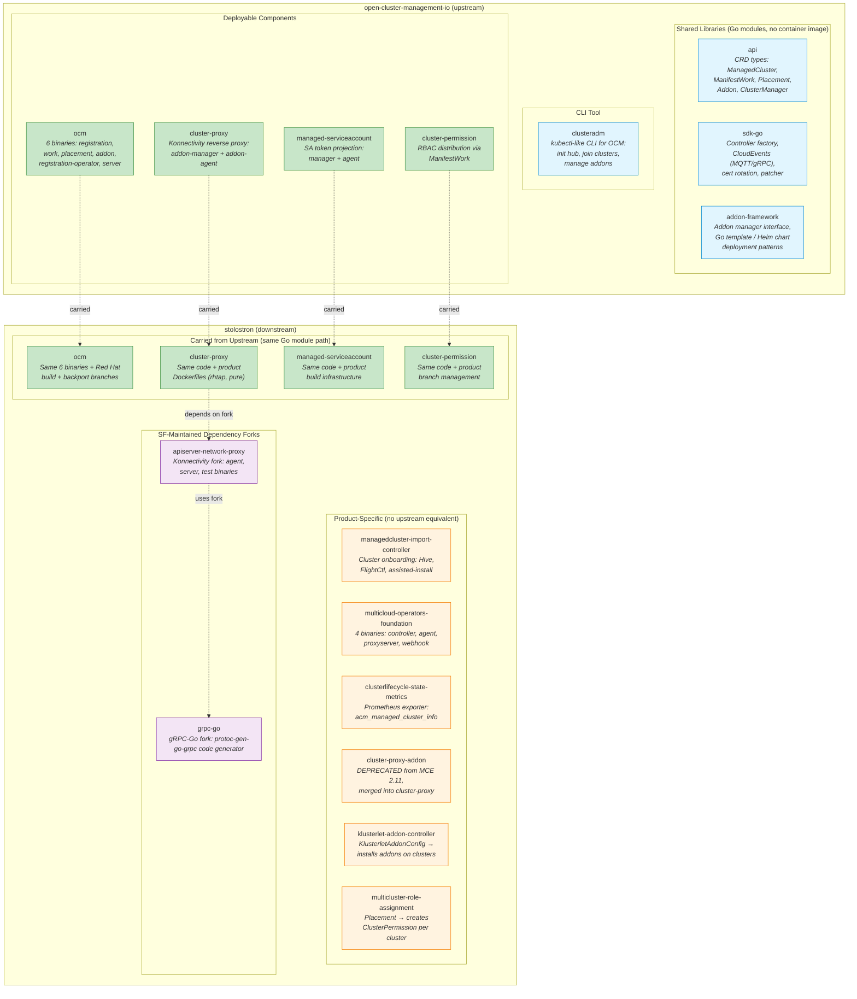
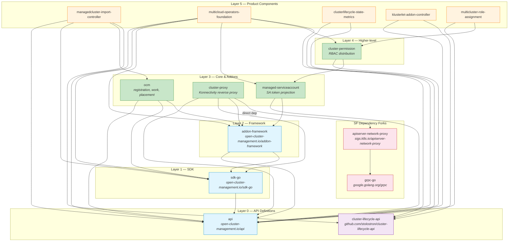
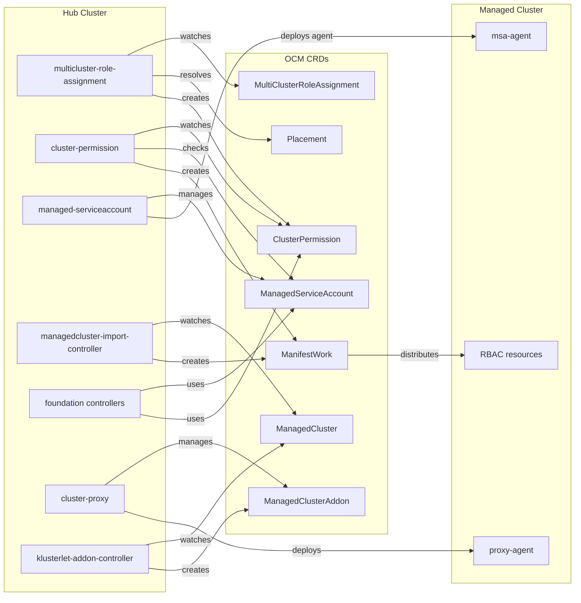

# Server Foundation: Upstream vs Downstream Repo Architecture

> **Generated**: 2026-05-27 | **Source**: `repos/repos.yaml` (categories: `server-foundation`, `deps`, `installer`) + `stolostron/cluster-lifecycle-api` (shared API library not yet in repos.yaml). All 22 repos shallow-cloned and analyzed via README, `go.mod`, `cmd/`, `pkg/`, and `backplane-operator` chart templates.
>
> This is a **generated file**. See [How to Regenerate](#how-to-regenerate) at the bottom.

## Context: The Two GitHub Organizations

Server Foundation (SF) works across two GitHub organizations that serve different purposes:

| Org | Role | Audience |
|-----|------|----------|
| [open-cluster-management-io](https://github.com/open-cluster-management-io) | **Upstream** — the CNCF sandbox project "Open Cluster Management" (OCM). Vendor-neutral, community-driven. | Any Kubernetes user who wants multicluster management. |
| [stolostron](https://github.com/stolostron) | **Downstream** — Red Hat's productization layer. Code here ships as MCE (Multicluster Engine) and ACM (Advanced Cluster Management). | Red Hat customers via OpenShift. |

The general flow is: features are developed upstream in OCM-io, then carried into stolostron where they get Red Hat build infrastructure, multi-version branch management, CI via Prow, and integration with the broader ACM/MCE product.

---

## Repo Source: `repos.yaml`

All repos analyzed here are sourced from [`repos/repos.yaml`](repos/repos.yaml), which defines these categories:

- **`server-foundation`** — SF-owned components (8 ocm-io + 10 stolostron = 18 repos)
- **`deps`** — forked dependency libraries with SF-specific changes (2 repos: `apiserver-network-proxy`, `grpc-go`)
- **`installer`** — not SF-owned, but tightly coupled deployment components (`backplane-operator`, `multiclusterhub-operator`)

Additionally, `stolostron/cluster-lifecycle-api` is a shared API library not currently in `repos.yaml` but used by 4 SF repos.

---

## Why It's Not a 1:1 Mirror

There are **8 upstream** repos and **10 downstream** repos in the `server-foundation` category, with only **4 appearing in both**. Plus **2 dependency forks** in `deps`. The mismatch exists for two structural reasons:

### 1. Upstream has shared libraries that don't need their own downstream repo

OCM's architecture is layered. The bottom layers (`api`, `sdk-go`, `addon-framework`) are **Go libraries** — they define types and provide utilities but produce no container image. Downstream repos consume them as `go.mod` dependencies (e.g., `open-cluster-management.io/api v1.2.0`). There's no point in having a stolostron copy of a library; you just import it.

`clusteradm` is a developer CLI tool (like `kubectl` for OCM) — it's not part of the product deployment, so it also has no downstream copy.

### 2. Downstream has product-specific controllers with no upstream equivalent

Several stolostron repos exist because the Red Hat product needs functionality that doesn't belong in the vendor-neutral upstream. For example, `managedcluster-import-controller` handles Hive-provisioned OpenShift cluster imports — that's a Red Hat/OpenShift-specific workflow. `multicloud-operators-foundation` is a large integration layer that aggregates cluster info, runs a proxy server for log access, and manages image registries — product-level orchestration that stitches multiple upstream components together.

---

## Repo Landscape



**Legend**: Blue = upstream-only (libraries/tools) | Green = paired (both orgs) | Orange = downstream-only (product-specific) | Purple = SF-maintained dependency forks

---

## Detailed Per-Repo Descriptions

### Upstream: Shared Libraries (no downstream copy)

#### `open-cluster-management-io/api`
**Module**: `open-cluster-management.io/api` | **Type**: Pure Go library (no binaries) | **Consumed by**: every other SF repo

Defines all OCM Custom Resource types and their generated clients. Contains four API groups:
- **cluster.open-cluster-management.io** — `ManagedCluster`, `ManagedClusterSet`, `Placement`, `PlacementDecision`, `ClusterClaim`, `AddonPlacementScore`
- **work.open-cluster-management.io** — `ManifestWork`, `AppliedManifestWork`, `ManifestWorkReplicaSet`
- **addon.open-cluster-management.io** — `ClusterManagementAddOn`, `ManagedClusterAddOn`, `AddonDeploymentConfig`
- **operator.open-cluster-management.io** — `ClusterManager`, `Klusterlet`

No container image is built — it exists purely as a Go dependency. Changes here have the **widest blast radius** across the entire SF codebase.

#### `open-cluster-management-io/sdk-go`
**Module**: `open-cluster-management.io/sdk-go` | **Type**: Pure Go library (no binaries) | **Consumed by**: addon-framework, ocm, cluster-proxy, managedcluster-import-controller, multicloud-operators-foundation, cluster-proxy-addon

Provides foundational building blocks for writing OCM controllers:
- **Controller factory** — base controller and event-handling utilities
- **CloudEvents clients** — protocol-agnostic messaging over MQTT (Paho), gRPC, and Google Pub/Sub for hub-to-managed-cluster communication
- **ManifestWork clients** — specialized kube-style clients for ManifestWork resources
- **Cert rotation** — automated certificate lifecycle management
- **Patcher** — resource patching utilities
- **CEL library** — Common Expression Language integration for policy evaluation

#### `open-cluster-management-io/addon-framework`
**Module**: `open-cluster-management.io/addon-framework` | **Type**: Go library with examples (no production binaries) | **Consumed by**: ocm, cluster-proxy, managed-serviceaccount, multicloud-operators-foundation, cluster-proxy-addon

Framework for building OCM addons. Handles the complex lifecycle of deploying software across a fleet of managed clusters:
- **Addon manager interface** — abstracts addon lifecycle (install, upgrade, remove)
- **Deployment methods** — Go templates, Helm charts, or `AddOnTemplate` CRDs
- **Agent interface** — standard pattern for addon agents running on managed clusters
- **Registration framework** — automatic addon registration with the hub
- **Hosted mode** — run addon agents on a hosting cluster instead of the managed cluster itself

#### `open-cluster-management-io/clusteradm`
**Module**: `open-cluster-management.io/clusteradm` | **Type**: CLI tool (1 binary)

The `kubectl`-like CLI for OCM. Used by developers and admins to:
- Initialize hub clusters (`clusteradm init`)
- Join managed clusters (`clusteradm join`)
- Manage cluster sets and placements
- Install and configure addons

Not part of the MCE/ACM product deployment — it's a standalone developer tool, so there's no downstream repo.

---

### Paired Repos (exist in both orgs)

These repos exist in **both** orgs. The stolostron copy shares the **same Go module path** (verified: both upstream and downstream `go.mod` line 1 matches, e.g., `module open-cluster-management.io/cluster-proxy`). The downstream adds Red Hat build artifacts and maintains backport branches.

#### `ocm` (paired)
**Module**: `open-cluster-management.io/ocm` | **Binaries**: 6 (verified: `cmd/` contains `addon`, `placement`, `registration`, `registration-operator`, `server`, `work`)

The heart of OCM — a monorepo that builds all core control-plane components:

| Binary (`cmd/`) | Function |
|-------|----------|
| `registration` | Hub-side controller that handles the "double opt-in" cluster registration handshake. Manages mTLS connections, cluster namespaces, CSR approval, certificate rotation. |
| `registration-operator` | Operator that installs/upgrades `ClusterManager` (hub-side) and `Klusterlet` (agent-side) from their CRs. |
| `work` | Distributes `ManifestWork` resources to managed clusters. Agent-side pulls ManifestWorks and applies them locally. |
| `placement` | Multicluster scheduler: evaluates `Placement` rules (label selectors, taints/tolerations, resource requirements) and produces `PlacementDecision` lists. |
| `addon` | Manages the lifecycle of `ClusterManagementAddOn` and `ManagedClusterAddOn` resources. |
| `server` | Kube-aggregated API server providing additional OCM endpoints. |

**Downstream difference**: Identical `cmd/` structure. The stolostron copy adds `deploy/cluster-manager` and `deploy/klusterlet` Helm chart directories, plus product-specific build configuration. Branches: `backplane-*` for MCE versions.

#### `cluster-proxy` (paired)
**Module**: `open-cluster-management.io/cluster-proxy` | **Binaries**: 3 (verified: `cmd/` contains `addon-manager`, `addon-agent`, `cluster-proxy`)

Solves the "hub can't reach managed cluster network" problem. Uses [apiserver-network-proxy](https://github.com/kubernetes-sigs/apiserver-network-proxy) (Konnectivity) to establish **reverse proxy tunnels** from managed clusters back to the hub. Hub-side controllers can then access services (like the Kubernetes API) in managed clusters even when clusters are in isolated VPCs.

- **addon-manager** — runs on the hub; manages proxy server installation
- **addon-agent** — runs on each managed cluster; establishes the reverse tunnel
- **cluster-proxy** — the proxy server binary itself

**External deps**: `sigs.k8s.io/apiserver-network-proxy` (Konnectivity) — direct dependency. The stolostron fork `stolostron/apiserver-network-proxy` is used in downstream builds.

**Downstream difference**: stolostron copy adds `Dockerfile.rhtap` (Red Hat Trusted Application Pipeline) and `pure.Dockerfile` for product builds. From MCE 2.11, the deprecated `cluster-proxy-addon` repo's functionality was merged here.

#### `managed-serviceaccount` (paired)
**Module**: `open-cluster-management.io/managed-serviceaccount` | **Binaries**: 3 (verified: `cmd/` contains `manager`, `agent`, `clusterprofile-credentials-plugin`)

Enables hub-side controllers to get valid authentication tokens for managed clusters without storing kubeconfigs. The hub creates a `ManagedServiceAccount` CR; the addon-agent on the managed cluster creates the corresponding `ServiceAccount`, obtains a token, and projects it back to the hub as a `Secret`.

- **manager** — hub-side addon manager that installs the agent on managed clusters
- **agent** — runs on managed clusters; creates SAs, rotates tokens, pushes tokens to hub
- **clusterprofile-credentials-plugin** — credential plugin for cluster profiles

**Consumed by**: `cluster-permission` (for binding subjects) and `multicloud-operators-foundation` (for cluster access).

**Downstream difference**: Same binaries and Go module. Stolostron copy adds product build infrastructure.

#### `cluster-permission` (paired)
**Module**: `open-cluster-management.io/cluster-permission` | **Binary**: 1 (single `main.go`)

Complements `managed-serviceaccount` — while MSA handles **authentication** (getting tokens), cluster-permission handles **authorization** (distributing RBAC). A `ClusterPermission` CR on the hub specifies Roles/ClusterRoles/Bindings; the controller creates `ManifestWork` resources to deploy those RBAC resources to the target managed cluster. Supports `ManagedServiceAccount` as a binding subject.

**Consumed by**: `multicluster-role-assignment` (creates ClusterPermission per placement match) and `multicloud-operators-foundation` (uses ClusterPermission client APIs).

**Downstream difference**: Same code and module. Originally ACM-only (`release-*` branches), migrated to MCE in version 2.17.

---

### Downstream-Only: Product-Specific Repos

These repos exist **only in stolostron** and have no upstream counterpart.

#### `stolostron/managedcluster-import-controller`
**Module**: `github.com/stolostron/managedcluster-import-controller` | **Binaries**: 2 (verified: `cmd/` contains `manager`, `tls-profile-sync`) | **Branch**: `backplane-*` (MCE) | **Deployed by**: server-foundation toggle chart

The entry point for bringing clusters into the ACM/MCE managed fleet. When a `ManagedCluster` resource is created on the hub, this controller handles the entire import workflow:

- **Manual import** — generates a klusterlet bootstrap ManifestWork
- **Hive import** — automatically imports clusters provisioned by Hive (`ClusterDeployment`)
- **FlightCtl import** — integrates with FlightCtl for edge device clusters (uses a forked FlightCtl library)
- **Assisted-install import** — supports OpenShift Assisted Installer provisioned clusters
- **Auto-import** — watches for new `ClusterDeployment` resources and auto-imports them
- **Self-managed cluster** — handles the local-cluster (hub managing itself)
- **CSR approval** — approves certificate signing requests from klusterlet agents
- **Hosted import** — supports hosted control plane cluster imports

Controllers (from `pkg/controller/`): `agentregistration`, `autoimport`, `clusterdeployment`, `clusternamespacedeletion`, `csr`, `flightctl`, `hosted`, `importconfig`, `importstatus`, `managedcluster`, `manifestwork`, `resourcecleanup`, `selfmanagedcluster`.

**Key deps**: `api`, `sdk-go`, `ocm` (chart helpers), `cluster-lifecycle-api`.

**Why no upstream**: Import workflows are deeply tied to OpenShift-specific concepts (Hive, assisted-install, OpenShift TLS profiles). Upstream OCM defines the registration protocol; the "how do you onboard clusters in an enterprise product" is a product concern.

#### `stolostron/multicloud-operators-foundation`
**Module**: `github.com/stolostron/multicloud-operators-foundation` | **Binaries**: 4 (verified: `cmd/` contains `controller`, `agent`, `proxyserver`, `webhook`) | **Branch**: `backplane-*` (MCE) | **Deployed by**: server-foundation toggle chart (as `ocm-controller`, `ocm-proxyserver`, `ocm-webhook`)

The largest SF repo by dependency footprint — the product integration layer that stitches upstream components together:

- **controller** (hub-side) — manages cluster CA certificates (`clusterca`), aggregates cluster info (`clusterinfo`), enforces cluster set RBAC (`clusterrole`, `clusterset`), handles image registries (`imageregistry`), manages garbage collection (`gc`), orchestrates ManagedServiceAccount resources
- **agent** (managed-cluster-side) — collects and reports cluster information back to the hub
- **proxyserver** — kube-aggregated API server that proxies requests to managed clusters, including a log proxy that uses cluster-proxy + ManagedServiceAccount to fetch pod logs from managed clusters
- **webhook** — validating/mutating webhooks for foundation resources

**Key deps**: `api`, `sdk-go`, `addon-framework`, `managed-serviceaccount`, `cluster-permission`, `cluster-lifecycle-api`. This is the **heaviest consumer** — it depends on the most SF repos of any component.

**Why no upstream**: This is the product glue. Upstream provides primitives (ManifestWork, Placement, Addons); this repo stitches them into a product experience. The proxyserver for log access, image registry management, and cluster info aggregation are ACM product features.

#### `stolostron/clusterlifecycle-state-metrics`
**Module**: `github.com/stolostron/clusterlifecycle-state-metrics` | **Binary**: 1 (verified: `cmd/clusterlifecycle-state-metrics`) | **Branch**: `backplane-*` (MCE) | **Deployed by**: cluster-lifecycle toggle chart (as `clusterlifecycle-state-metrics-v2`)

A Prometheus metrics exporter modeled after [kube-state-metrics](https://github.com/kubernetes/kube-state-metrics). Exposes the `acm_managed_cluster_info` gauge metric with labels: `hub_cluster_id`, `managed_cluster_id`, `vendor` (OpenShift/EKS/AKS/...), `cloud` (Amazon/Azure/Google/...), `version`, `vcpu`, `created_via`. Includes collectors for cluster hibernation state, cluster IDs, and cluster timestamps.

**Key deps**: `api`, `cluster-lifecycle-api`, `stolostron/applier`, `stolostron/library-go`.

**Why no upstream**: Upstream OCM doesn't impose an observability model. These metrics map to Red Hat's telemetry and customer fleet-wide reporting needs.

#### `stolostron/cluster-proxy-addon` (DEPRECATED)
**Module**: `github.com/stolostron/cluster-proxy-addon` | **Branch**: `backplane-*` (MCE, active for 2.6–2.10 only) | **Deployed by**: cluster-proxy-addon toggle chart

**Deprecated from MCE 2.11** — all functionality merged into `stolostron/cluster-proxy`.

Previously held downstream-specific parts of cluster proxy deployment: the ANP container image, an HTTP user-server for HTTP-based proxy access (not just gRPC), service proxy controller, and integration with OpenShift service-serving certificates. Packages: `serviceproxy`, `userserver`, `controllers`.

**Key deps**: `api` (v0.15.0), `sdk-go` (v0.15.0), `addon-framework` (v0.11.0) — very outdated dependency versions.

#### `stolostron/klusterlet-addon-controller`
**Module**: `github.com/stolostron/klusterlet-addon-controller` | **Binary**: 1 (verified: `cmd/manager`) | **Branch**: `release-*` (ACM)

Manages the `KlusterletAddonConfig` custom resource — a product-level CR that specifies which ACM add-ons to install on a managed cluster, along with image overrides, pull policy, pull secrets, node selectors, and proxy config. The controller reads `KlusterletAddonConfig` and creates corresponding `ManagedClusterAddon` resources via `ManifestWork`.

**Key deps**: `api`, `cluster-lifecycle-api`.

**Why no upstream**: Upstream has the addon-framework for *building* addons and `ManagedClusterAddOn` for *representing* addon state, but no product-level controller that decides "which addons to install based on a configuration CR." That's a product deployment decision.

#### `stolostron/multicluster-role-assignment`
**Module**: `github.com/stolostron/multicluster-role-assignment` | **Binary**: 1 (verified: `cmd/main.go`) | **Branch**: `release-*` (ACM)

Higher-level RBAC abstraction on top of `cluster-permission`. While `ClusterPermission` targets a single managed cluster namespace, `MulticlusterRoleAssignment` uses OCM's `Placement` API to dynamically select clusters and create one `ClusterPermission` per matched cluster. Uses annotation-based ownership tracking for safe concurrent management.

**Key deps**: `api`, `cluster-permission`.

**Why no upstream**: `cluster-permission` exists upstream, but this placement-based orchestration is an ACM product feature.

---

### SF-Maintained Dependency Forks (`deps` category)

These repos are listed under the `deps` category in `repos.yaml`. They are **forks of upstream open-source projects** that SF maintains with specific patches needed by SF components. They retain the original upstream module paths.

#### `stolostron/apiserver-network-proxy`
**Upstream**: [kubernetes-sigs/apiserver-network-proxy](https://github.com/kubernetes-sigs/apiserver-network-proxy) (Konnectivity) | **Module**: `sigs.k8s.io/apiserver-network-proxy` | **Binaries**: 4 (`cmd/` contains `agent`, `server`, `test-client`, `test-server`)

Fork of the Kubernetes Konnectivity project. Konnectivity provides a reverse proxy tunnel that allows the API server (or hub) to reach nodes/pods in networks that can't be directly accessed. The `agent` establishes an outbound connection from the managed cluster to the `server` running on the hub; traffic is then proxied through this tunnel.

SF maintains this fork to carry patches that haven't been accepted upstream or are specific to the OCM cluster-proxy use case. The fork keeps the original module path (`sigs.k8s.io/apiserver-network-proxy`), so downstream builds use `replace` directives to point to this fork.

**Direct consumers**: `cluster-proxy` (both upstream and downstream), `cluster-proxy-addon` (deprecated).

#### `stolostron/grpc-go`
**Upstream**: [grpc/grpc-go](https://github.com/grpc/grpc-go) | **Module**: `google.golang.org/grpc` | **Binary**: 1 (`cmd/protoc-gen-go-grpc` — protobuf gRPC code generator)

Fork of the Go gRPC library. Maintained by SF because `apiserver-network-proxy` depends on gRPC for its tunnel protocol. The fork carries patches needed for the ANP fork's specific gRPC usage. Referenced in the `cluster-proxy-addon` README as a transitive dependency of the ANP fork.

**Consumed by**: `apiserver-network-proxy` (the fork consumes the gRPC fork).

---

## Notable Shared Dependencies

These are not SF-owned repos, but they appear as important shared dependencies across multiple SF repos.

| Dependency | Module Path | Used By | What It Provides |
|------------|-------------|---------|-----------------|
| **cluster-lifecycle-api** | `github.com/stolostron/cluster-lifecycle-api` | managedcluster-import-controller, multicloud-operators-foundation, clusterlifecycle-state-metrics, klusterlet-addon-controller | Product-specific CRD types: `ManagedClusterAction`, `ManagedClusterView`, `ManagedClusterImageRegistry`, `ManagedClusterInfo`, `KlusterletConfig`. Originally extracted from multicloud-operators-foundation. |
| **stolostron/applier** | `github.com/stolostron/applier` | clusterlifecycle-state-metrics | Kubernetes resource applier utility library. |
| **stolostron/library-go** | `github.com/stolostron/library-go` | clusterlifecycle-state-metrics | Shared Go utility library for stolostron projects. |
| **backplane-operator** | `github.com/stolostron/backplane-operator` | (deploys all SF components) | MCE operator — not SF-owned, but the deployment root that installs all SF components via Helm charts and `ClusterManager` CR. Listed under `installer` category in repos.yaml. |

---

## Go Module Dependency Flow

Arrows mean "depends on" (imports as a Go module). Only **direct** dependencies shown (verified against actual `go.mod` `require` lines, excluding `// indirect`).



**Legend**: Blue = upstream-only libraries | Green = paired (both orgs) | Orange = downstream-only product components | Purple = shared stolostron dependency | Red = SF-maintained dependency forks

---

## Deployment Topology

How `backplane-operator` (the MCE operator) deploys Server Foundation components at runtime. Verified against actual Helm chart templates in `backplane-operator/pkg/templates/charts/toggle/`.

```mermaid
graph TD
    BPO["backplane-operator<br/><i>MCE Operator</i>"]

    subgraph "cluster-manager toggle chart"
        REG["registration"]
        WORK["work"]
        PLACE["placement"]
        ADDONMGR["addon-manager"]
    end

    subgraph "server-foundation toggle chart"
        MIC["managedcluster-import-controller"]
        OCMCTRL["ocm-controller<br/><i>(foundation controller)</i>"]
        OCMPROXY["ocm-proxyserver<br/><i>(foundation proxyserver)</i>"]
        OCMWH["ocm-webhook<br/><i>(foundation webhook)</i>"]
    end

    subgraph "cluster-lifecycle toggle chart"
        CLSM["clusterlifecycle-state-metrics-v2"]
    end

    subgraph "Individual toggle charts"
        CPERM["cluster-permission"]
        MSA["managed-serviceaccount"]
        CPA["cluster-proxy-addon"]
    end

    BPO -->|"ClusterManager CR"| REG
    BPO -->|"ClusterManager CR"| WORK
    BPO -->|"ClusterManager CR"| PLACE
    BPO -->|"ClusterManager CR"| ADDONMGR
    BPO -->|"server-foundation chart"| MIC
    BPO -->|"server-foundation chart"| OCMCTRL
    BPO -->|"server-foundation chart"| OCMPROXY
    BPO -->|"server-foundation chart"| OCMWH
    BPO -->|"cluster-lifecycle chart"| CLSM
    BPO -->|"toggle chart"| CPERM
    BPO -->|"toggle chart"| MSA
    BPO -->|"toggle chart"| CPA

    classDef operator fill:#ffecb3,stroke:#ff8f00
    classDef core fill:#e1f5fe,stroke:#0288d1
    classDef sf fill:#e8f5e9,stroke:#388e3c
    classDef toggle fill:#fff3e0,stroke:#f57c00
    classDef lifecycle fill:#f3e5f5,stroke:#7b1fa2

    class BPO operator
    class REG,WORK,PLACE,ADDONMGR core
    class MIC,OCMCTRL,OCMPROXY,OCMWH sf
    class CPERM,MSA,CPA toggle
    class CLSM lifecycle
```



**Key deployment relationships:**
- `backplane-operator` creates a `ClusterManager` CR which triggers `registration-operator` (from `ocm` repo) to deploy the four OCM core controllers.
- The **server-foundation** toggle chart deploys `managedcluster-import-controller` and all `multicloud-operators-foundation` binaries (as `ocm-controller`, `ocm-proxyserver`, `ocm-webhook`).
- The **cluster-lifecycle** toggle chart (not the server-foundation chart) deploys `clusterlifecycle-state-metrics`.
- `cluster-permission`, `managed-serviceaccount`, and `cluster-proxy-addon` each have their **own individual toggle charts**.

---

## Runtime Integration Flow

How the components interact at runtime — which controllers watch which CRDs and what resources they create. Shows the data flow between hub cluster, managed cluster, and OCM CRDs.



**Reading the flow:**
- When a **ManagedCluster** is created, `managedcluster-import-controller` watches it and creates **ManifestWork** resources to bootstrap the klusterlet on the managed cluster.
- `klusterlet-addon-controller` also watches **ManagedCluster** and creates **ManagedClusterAddon** resources based on `KlusterletAddonConfig`.
- `cluster-proxy` manages the **ManagedClusterAddon** for the proxy and deploys the **proxy-agent** on managed clusters.
- `managed-serviceaccount` manages **ManagedServiceAccount** CRs and deploys the **msa-agent** which projects SA tokens back to the hub.
- `cluster-permission` watches **ClusterPermission** CRs, checks for associated **ManagedServiceAccount**, and creates **ManifestWork** to distribute RBAC resources to managed clusters.
- `multicluster-role-assignment` watches **MultiClusterRoleAssignment** CRs, resolves **Placement** to select clusters, and creates **ClusterPermission** per selected cluster.
- `foundation controllers` uses both **ManagedServiceAccount** and **ClusterPermission** CRs for cluster info aggregation and proxy server operations.

---

## Architectural Observations

1. **Clean layered architecture** — no circular dependencies in the upstream layers. Each layer only depends on layers below it.

2. **`api` is the universal foundation** — every SF repo depends on it. Changes to `api` have the widest blast radius across the entire codebase.

3. **`multicloud-operators-foundation` is the heaviest consumer** — it depends on `api`, `sdk-go`, `addon-framework`, `managed-serviceaccount`, `cluster-permission`, and `cluster-lifecycle-api`. More inter-repo dependencies than any other SF component.

4. **`backplane-operator` is the deployment root** — it deploys all MCE/SF components via Helm charts and the `ClusterManager` CR. It is not SF-owned but is tightly coupled. Listed under `installer` in repos.yaml.

5. **`cluster-lifecycle-api` is the shared product API library** — used by 4 downstream repos (MIC, MOF, CLSM, KAC). It defines product-specific CRD types (`ManagedClusterInfo`, `ManagedClusterAction`, `ManagedClusterView`, `ManagedClusterImageRegistry`, `KlusterletConfig`) originally extracted from `multicloud-operators-foundation`.

6. **RBAC distribution pipeline**: `MultiClusterRoleAssignment` → `Placement` → `ClusterPermission` → `ManifestWork` → managed cluster RBAC resources. This is a three-controller chain spanning two repos (`multicluster-role-assignment` and `cluster-permission`).

7. **Authentication + Authorization pairing**: `managed-serviceaccount` handles authentication (token projection), `cluster-permission` handles authorization (RBAC distribution). Together they form the complete identity model for hub-to-managed-cluster access.

8. **SF-maintained forks form a dependency chain**: `grpc-go` (fork) → `apiserver-network-proxy` (fork) → `cluster-proxy` (SF component). This chain is critical for the Konnectivity tunnel used by cluster-proxy. SF maintains these forks to carry patches not accepted upstream or specific to the OCM use case.

---

## Branch Conventions

| Context | Branch Pattern | Example | Who Uses It |
|---------|---------------|---------|-------------|
| Upstream (ocm-io) | `main` + semver tags | `v1.3.0` | All ocm-io repos |
| Downstream MCE | `backplane-X.Y` | `backplane-2.9` | ocm, cluster-proxy, managed-serviceaccount, managedcluster-import-controller, multicloud-operators-foundation, clusterlifecycle-state-metrics, cluster-proxy-addon |
| Downstream ACM | `release-X.Y` | `release-2.14` | klusterlet-addon-controller, cluster-permission (pre-2.17), multicluster-role-assignment |
| Development | `main` | — | Fast-forwards to latest backplane/release branch |

### Key Version Relationships

- **ACM <= 2.16**: MCE version = ACM version minus 5 (e.g., ACM 2.14 → MCE 2.9)
- **ACM >= 2.17**: MCE version matches ACM (e.g., ACM 2.17 → MCE 2.17)
- **OCP version**: Always ACM version + 5 (e.g., ACM 2.17 → OCP 4.22)

---

## Summary Matrix

| Repo | ocm-io | stolostron | Category | Type | Binaries | What It Does |
|------|:------:|:----------:|----------|------|:--------:|-------------|
| **api** | Y | — | SF | Library | 0 | CRD types and generated clients for all OCM resources |
| **sdk-go** | Y | — | SF | Library | 0 | Controller factory, CloudEvents, cert rotation, patcher |
| **addon-framework** | Y | — | SF | Library | 0 | Addon lifecycle: Helm, Go template, hosted mode |
| **clusteradm** | Y | — | SF | CLI | 1 | kubectl-like CLI for OCM hub/cluster operations |
| **ocm** | Y | Y | SF | Component | 6 | Registration, work distribution, placement, addon manager |
| **cluster-proxy** | Y | Y | SF | Addon | 3 | Konnectivity reverse proxy tunnels to managed clusters |
| **managed-serviceaccount** | Y | Y | SF | Addon | 3 | SA token projection from managed clusters to hub |
| **cluster-permission** | Y | Y | SF | Controller | 1 | RBAC distribution to managed clusters via ManifestWork |
| **managedcluster-import-controller** | — | Y | SF | Controller | 2 | Cluster onboarding: Hive, FlightCtl, assisted-install |
| **multicloud-operators-foundation** | — | Y | SF | Platform | 4 | Cluster info, proxy server, image registry, webhook |
| **clusterlifecycle-state-metrics** | — | Y | SF | Exporter | 1 | Prometheus metrics: acm_managed_cluster_info |
| **cluster-proxy-addon** | — | Y | SF | Addon | — | DEPRECATED (MCE 2.11+), merged into cluster-proxy |
| **klusterlet-addon-controller** | — | Y | SF | Controller | 1 | KlusterletAddonConfig → installs addons on clusters |
| **multicluster-role-assignment** | — | Y | SF | Controller | 1 | Placement-based RBAC: auto-creates ClusterPermission |
| **apiserver-network-proxy** | — | Y | Dep Fork | Proxy | 4 | Konnectivity fork: agent, server (patches for OCM use) |
| **grpc-go** | — | Y | Dep Fork | Library | 1 | gRPC-Go fork: carries patches for ANP fork |

**Totals**: 8 upstream (ocm-io), 12 downstream (stolostron: 10 SF + 2 dep forks), 4 paired, 4 upstream-only, 6 downstream-only product components, 2 dependency forks.

---

## How to Regenerate

This file is generated by the `sfa-repo-architecture` skill. The skill reads `repos/repos.yaml` to dynamically determine which repos to clone (from the `server-foundation` and `deps` categories), adds context repos (`backplane-operator`, `cluster-lifecycle-api`), clones them all to a temp directory, reads their actual code, and generates this document. It includes a verification step that checks every claim against the cloned repos before finalizing.

Regenerate when repos are added/removed from `repos.yaml` or when repo functionality changes:

```
# Claude Code / Claude Agent — use any trigger phrase:
generate repo architecture
repo architecture
upstream downstream diagram
ocm vs stolostron
```

**Skill file**: [`.claude/skills/sfa-repo-architecture/SKILL.md`](.claude/skills/sfa-repo-architecture/SKILL.md)

---

*This document supersedes the older `docs/repo-dependencies.md` and `docs/repo-deps/` files, which are now marked as outdated.*
