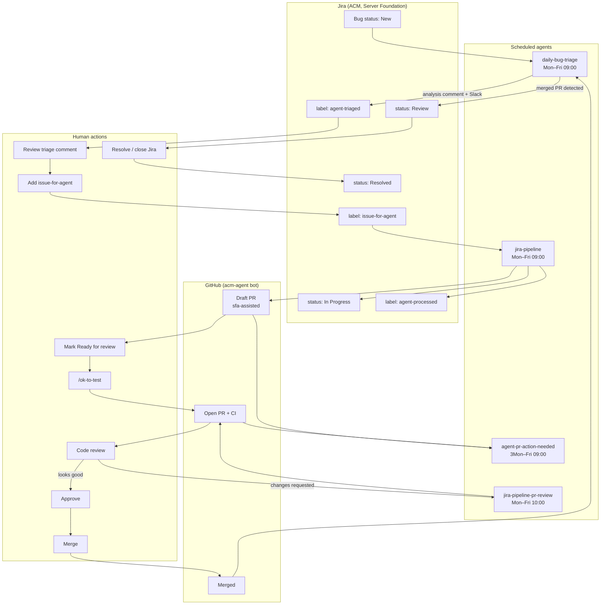
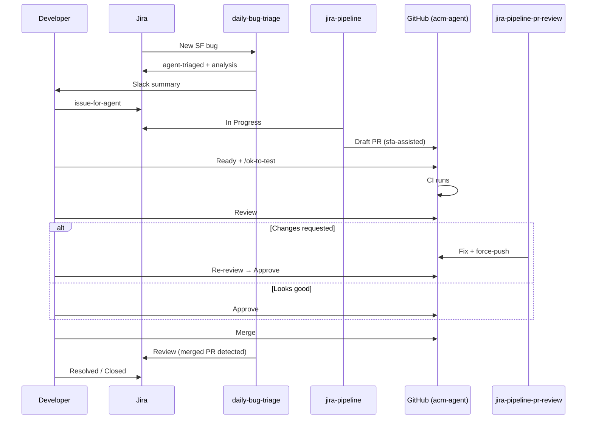

# Automated Bug Fix — Developer Guide

This guide describes the **end-to-end flow** for fixing Server Foundation Jira bugs with
[server-foundation-agent](https://github.com/stolostron/server-foundation-agent). It covers
what runs automatically, what requires a human, and how to move a bug from **New** to a
merged PR and closed issue.

**Audience:** SF developers who triage bugs, groom the agent queue, review bot PRs, and
close issues.

**Operator docs** (agent-swarm prompts, scripts, phases): see
[prompts/README.md](../prompts/README.md) and the linked workflow docs under
`workflows/`.

**Related:** [Automated CVE fix — developer guide](automated-cve-fix-developer-guide.md)
for ProsSec vulnerability issues and dependency-bump PRs.

---

## At a glance

| Stage | Who runs it | What happens | Human required? |
|-------|-------------|--------------|-----------------|
| 0. Merged PR → Review | `daily-bug-triage` Phase 0 (every triage run) | Detects merged fix PRs; Jira **In Progress** → **Review** | No |
| 1. Daily triage | `daily-bug-triage` (weekdays 09:00) | Root-cause analysis, Jira comment, Slack summary | No — review output |
| 2. Opt in to fix | Developer | Add label `issue-for-agent` on Jira | **Yes** |
| 3. Implement fix | `jira-pipeline` (weekdays 09:00) | One issue → draft PR; Jira → **In Progress** | No |
| 4. PR reminders | `agent-pr-action-needed` (weekdays 09:00) | Slack digest of blocked PRs | No — act on Slack |
| 5. Groom PR | Developer | Mark ready, `/ok-to-test`, review | **Yes** |
| 6. Address review | `jira-pipeline-pr-review` (weekdays 10:00) | Fix review comments, squash, force-push | No — re-review |
| 7. Approve & merge | Developer | Approve and merge when CI is green | **Yes** |
| 8. Close Jira | Developer | Transition to **Resolved** / **Closed** after merge | **Yes** |

Agents **never** merge PRs, approve PRs, or mark draft PRs ready. Jira **Review** is set
automatically by **`daily-bug-triage`** when `gh` confirms the fix PR is **merged** (not
when the draft PR is posted).

---

## End-to-end flow



### Swimlane view

Human–agent handoffs in sequence:



---

## Stage 1 — Daily bug triage

**Agent:** [daily-bug-triage](../prompts/daily-bug-triage.md)  
**Schedule:** Weekdays 09:00 EST  
**Workflow reference:** [workflows/daily-bug-triage.md](../workflows/daily-bug-triage.md)

### Phase 0 — Merged PR → Review (runs first)

Before analyzing New bugs, every triage run checks **In Progress** SF bugs for merged fix
PRs (same detection pattern as [fix-cve](../prompts/fix-cve.md) §6.5):

1. Query bugs in status **In Progress** (component Server Foundation).
2. Find linked PRs via Jira development field, agent comments, or
   `gh pr list --state merged --search "ACM-KEY in:title"`.
3. Verify with `gh pr view` that `state` is **MERGED**.
4. Post a `Bug Fix: PR merged` comment on the issue.
5. Transition Jira to **Review**.

Runs even when there are zero New bugs. Skip with `SKIP_PR_MERGE_REVIEW` in
`instruction_prompt`. If a merge comment exists but status is still **In Progress**, the
next run retries the transition.

### What triage does for New bugs

1. Finds all **New** bugs in project **ACM**, component **Server Foundation**.
2. Skips bugs already analyzed (label `agent-triaged` or existing triage comment).
3. Runs codebase root-cause analysis per bug (sub-agents).
4. Posts a **Bug Triage Analysis** comment on each analyzed issue.
5. Adds label **`agent-triaged`**.
6. Sends a **Slack summary** to the SF channel.

### What it does *not* do (by default)

- Does **not** change status for **New** bugs (only Phase 0 moves **In Progress** →
  **Review** when a fix PR is merged).
- Does **not** open fix PRs unless operators enable `ENABLE_AUTO_FIX` (off by default).
- Does **not** add `issue-for-agent` — that is always a human decision.
- Does **not** resolve or close Jira issues.

### What you should do

1. Read the triage comment on your bug (or the Slack digest).
2. Check: root cause, relevant repo/files, suggested fix, confidence.
3. Decide whether the agent should attempt a fix (see Stage 2).

**Triage comment markers** (for dedup): heading `Bug Triage Analysis` and footer
`server-foundation-agent (daily bug triage)`.

---

## Stage 2 — Opt in to agent fix (human gate)

This is the **primary human approval** to let automation implement a fix.

### Action

On the Jira issue, add label:

```text
issue-for-agent
```

### Preconditions

The issue should already have:

| Requirement | Why |
|-------------|-----|
| Label `agent-triaged` | Triage analysis exists for the agent to follow |
| Status **New** or **To Do** | Matches agent queue JQL |
| Component **Server Foundation** | SF scope only |
| Not label `agent-processed` | Not already picked up by pipeline |

### Grooming tips

- Review the triage **suggested fix** — if it is wrong or too vague, fix the analysis
  manually or implement yourself instead of opting in.
- For release-branch fixes, ensure triage notes or the description mention the target
  branch (`release-*`, `backplane-*`).
- One issue per pipeline run — oldest opted-in issue is picked first.

### Retry after a failed pipeline run

If the pipeline failed (comment on issue, no `agent-processed` label):

1. **Remove** nothing — `issue-for-agent` stays.
2. Fix blockers manually or improve triage context.
3. Wait for the next pipeline slot (09:00).

If the pipeline succeeded but the PR was wrong:

1. **Remove** label `agent-processed`.
2. **Keep** `issue-for-agent`.
3. Close or abandon the bad PR manually.
4. Next pipeline run will retry the issue.

---

## Stage 3 — Jira pipeline (implement fix)

**Agent:** [jira-pipeline](../prompts/jira-pipeline.md)  
**Schedule:** Weekdays 09:00  
**Implements via:** [jira-solve](../prompts/jira-solve.md) (one issue per run)

### Agent queue JQL

Issues are picked only when **all** of these are true:

```text
project = ACM
AND component = "Server Foundation"
AND resolution = Unresolved
AND status in (New, "To Do")
AND labels = agent-triaged
AND labels = issue-for-agent
AND labels != agent-processed
ORDER BY created ASC
```

### What it does

1. Picks **one** issue (oldest by created date).
2. Loads triage context from the Bug Triage Analysis comment.
3. Transitions Jira to **In Progress** (start of fix).
4. Clones a worktree, implements per suggested fix, runs `make check` and `make test`.
5. Opens a **draft** PR as `acm-agent[bot]` with:
   - Title: `ACM-<KEY>: <summary>`
   - Label: `sfa-assisted`
   - Often: `needs-ok-to-test` on stolostron repos
6. Comments on Jira with the PR link.
7. Adds label **`agent-processed`**.

The issue stays **In Progress** while the draft PR is open. **`daily-bug-triage`** moves
it to **Review** after you merge the PR (Phase 0 on the next weekday 09:00 run, or any
scheduled triage run).

### What you should do

- Watch Jira for the pipeline comment and PR link.
- Do **not** expect CI to run yet — the PR is still a draft.

**On-demand fix** for a single groomed issue: run [jira-solve](../prompts/jira-solve.md)
with `instruction_prompt: ACM-12345` instead of waiting for the schedule.

---

## Stage 4 — PR action reminders (Slack)

**Agent:** [agent-pr-action-needed](../prompts/agent-pr-action-needed.md)  
**Schedule:** Weekdays 09:00 
**Workflow reference:** [workflows/agent-pr-action-needed.md](../workflows/agent-pr-action-needed.md)

### What it does

Scans open `acm-agent` PRs and posts a **Slack digest** of PRs blocked on humans. It does
**not** change GitHub or Jira.

### Slack buckets

| Bucket | PR state | What you need to do |
|--------|----------|---------------------|
| `draft_ready_for_review` | Draft | Mark **Ready for review**; comment **`/ok-to-test`** if `needs-ok-to-test` is present |
| `awaiting_approval` | Open, review required | **Approve** when the change looks good |

PRs with **`CHANGES_REQUESTED`** are **not** in this digest — feedback must be addressed
first (Stage 6).

---

## Stage 5 — Groom the PR (human gate)

After the pipeline creates a draft PR, **CI and formal review do not proceed** until you
complete these steps.

### Checklist

1. **Open the draft PR** (linked from Jira comment or Slack).
2. **Skim the diff** — agent fixes are minimal but not infallible.
3. **Mark Ready for review** (GitHub: "Ready for review" on the draft).
4. If the PR has label **`needs-ok-to-test`**, comment on the PR:
   ```text
   /ok-to-test
   ```
   This is required on stolostron/openshift org repos before Prow runs.
5. Wait for CI; perform or delegate **code review**.

### Bot PR signals

| Signal | Value |
|--------|-------|
| Author | `acm-agent` / `app/acm-agent` |
| Label | `sfa-assisted` |
| Branch | `sfa/fix-ACM-<KEY>` (or variants) |

---

## Stage 6 — Review feedback loop

**Agent:** [jira-pipeline-pr-review](../prompts/jira-pipeline-pr-review.md)  
**Schedule:** Weekdays 10:00  
**Workflow reference:** [workflows/jira-pipeline-pr-review.md](../workflows/jira-pipeline-pr-review.md)

### When this runs

After you marked the PR ready and reviewers (CodeRabbit or humans) left **actionable**
feedback with `CHANGES_REQUESTED` or unresolved review threads.

### What it does

1. Picks **one** eligible pipeline PR per run.
2. Addresses review comments (minimal scope).
3. Runs `make check` and `make test`.
4. Squashes to a **single commit** and **force-pushes** the branch.
5. Comments on the linked Jira issue.

### What it does *not* do

- Does not approve, merge, or mark PRs ready.
- Does not handle draft PRs still waiting for Stage 5.

### What you should do

1. Re-review after the agent pushes updates.
2. Approve when satisfied (Stage 7).
3. If the agent cannot fix the feedback, implement remaining changes yourself on the
   same branch or take over the PR.

---

## Stage 7 — Approve and merge (human gate)

| Action | Who |
|--------|-----|
| Approve PR | SF developer (org member) |
| Merge PR | Assignee or reviewer per team practice |

Agents never approve or merge. Branch protection and `reviewDecision: REVIEW_REQUIRED`
require a human approver.

After merge, cherry-pick or backport per your release process if the fix targeted `main`
but the bug applies to a release branch.

---

## Stage 8 — Resolve the Jira issue (human gate)

**`daily-bug-triage`** moves the issue to **Review** when the fix PR is merged (Phase 0).
**Resolved** / **Closed** after merge verification is manual:

1. Wait for triage to transition **In Progress** → **Review** (next weekday 09:00 after
   merge, unless you move it yourself sooner).
2. Verify the fix in the target environment if needed.
3. Comment on Jira with merge confirmation if helpful (triage may already have posted
   `Bug Fix: PR merged`).
4. Transition to **Resolved** or **Closed** per [Jira workflows](jira/workflows.md) and team
   practice.
5. Remove or retain labels as you prefer — they do not block future automation.

### Jira status automation summary

| Status | Set by | When |
|--------|--------|------|
| **In Progress** | `jira-solve` (via `jira-pipeline`) | Fix work starts |
| **Review** | `daily-bug-triage` (Phase 0) | Fix PR **merged** (`gh` confirms `MERGED`) |
| **Resolved** / **Closed** | **Developer** | After merge verification |

---

## Jira labels reference

| Label | Set by | Meaning |
|-------|--------|---------|
| `agent-triaged` | daily-bug-triage | Triage analysis posted; dedup marker |
| `issue-for-agent` | **Human** | Opt in — issue is in the fix queue |
| `agent-processed` | jira-pipeline | Pipeline completed (draft PR created) |

**Queue grooming:** triage → human adds `issue-for-agent` → pipeline fixes one issue →
`agent-processed`.

---

## Schedule summary (weekdays)

All times EST (example from agent-swarm CronTask config):

| Time | Agent | Purpose |
|------|-------|---------|
| 09:00 | daily-bug-triage | Merged PR → Review (Phase 0); analyze New bugs |
| 09:00 | jira-pipeline | Fix one opted-in issue |
| 09:30 | agent-pr-action-needed | Slack: drafts / approvals needed |
| 10:00 | jira-pipeline-pr-review | Address review feedback (one PR) |
| 17:00 | jira-pipeline | Fix one opted-in issue |
| 17:30 | agent-pr-action-needed | Slack: drafts / approvals needed |
| 18:00 | jira-pipeline-pr-review | Address review feedback (one PR) |

Throughput: at most **one bug fix** and **one review-feedback PR** per scheduled slot.

---

## Human interaction summary

```text
YOU MUST ACT WHEN:
  ✓ Deciding if agent should fix     → add issue-for-agent
  ✓ Draft PR exists                  → Ready for review + /ok-to-test
  ✓ Review is clean                  → Approve
  ✓ CI green + approved              → Merge

AGENTS ACT WITHOUT YOU:
  ✓ Triage New bugs (analysis + Slack)
  ✓ Implement fix (draft PR only)
  ✓ Move Jira In Progress → Review when fix PR is merged (daily-bug-triage Phase 0)
  ✓ Remind on Slack about blocked PRs
  ✓ Address review comments (when CHANGES_REQUESTED)
```

---

## Common scenarios

### "My bug was triaged but nothing happened"

Add **`issue-for-agent`** if you want the pipeline to pick it up. Triage alone does not
trigger a fix.

### "Pipeline ran but no PR"

Check the Jira comment for failure details. The issue will **not** have `agent-processed`.
Fix blockers and wait for the next slot, or run **jira-solve** on demand.

### "PR is draft and CI is not running"

Mark **Ready for review** and post **`/ok-to-test`** if `needs-ok-to-test` is on the PR.

### "Slack says awaiting approval but I requested changes"

That PR is in the review-feedback loop, not the approval digest. Wait for
**jira-pipeline-pr-review** or push fixes yourself.

### "I want to fix it myself instead"

Do not add `issue-for-agent`. Use the triage comment as a head start and open a normal
human PR.

### "PR merged but Jira still In Progress"

**`daily-bug-triage`** Phase 0 transitions **In Progress** → **Review** when `gh`
confirms the fix PR is merged. This runs on the next weekday 09:00 triage (or move to
**Review** yourself). Check for a `Bug Fix: PR merged` comment from
`server-foundation-agent`. If the comment exists but status did not change, the next run
retries the transition.

### "Wrong repo or wrong analysis"

Do not add `issue-for-agent`. Add a correcting Jira comment; optionally remove
`agent-triaged` and ask for re-triage with `SKIP_DEDUP` on the operator side.

---

## Quick reference card

```text
NEW BUG
  → wait for triage (weekday 09:00) or read Slack
  → review "Bug Triage Analysis" comment

WANT AGENT FIX
  → add label: issue-for-agent
  → wait for pipeline (09:00)

DRAFT PR APPEARS
  → Ready for review
  → /ok-to-test (if labeled needs-ok-to-test)
  → review → approve → merge
  → wait for triage to move Jira to Review (weekday 09:00)
  → resolve Jira

CHANGES REQUESTED
  → wait for jira-pipeline-pr-review (10:00) or fix yourself
  → re-review → approve → merge
```
