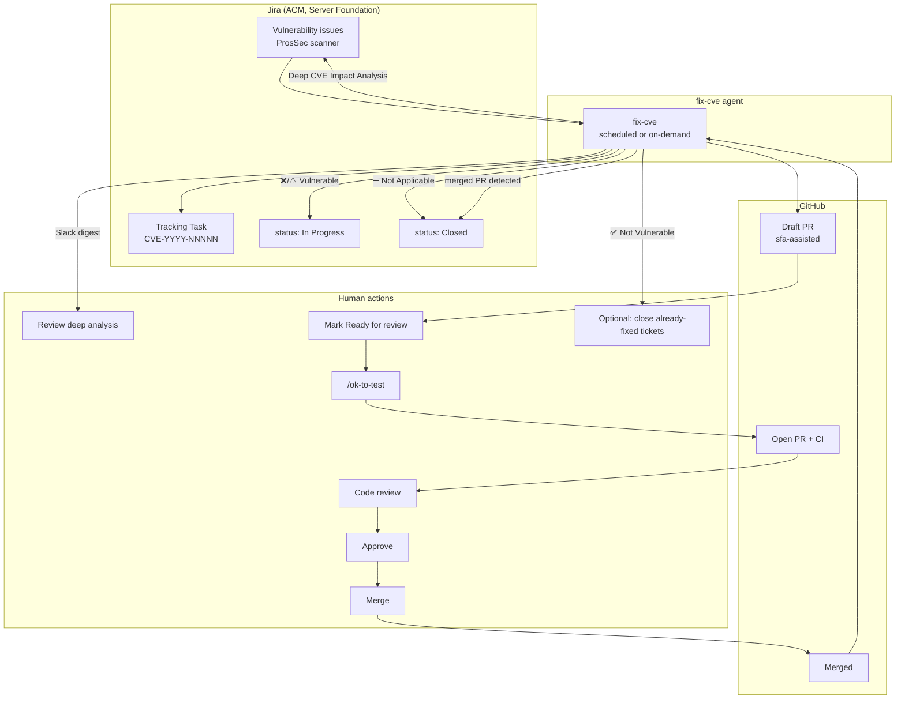
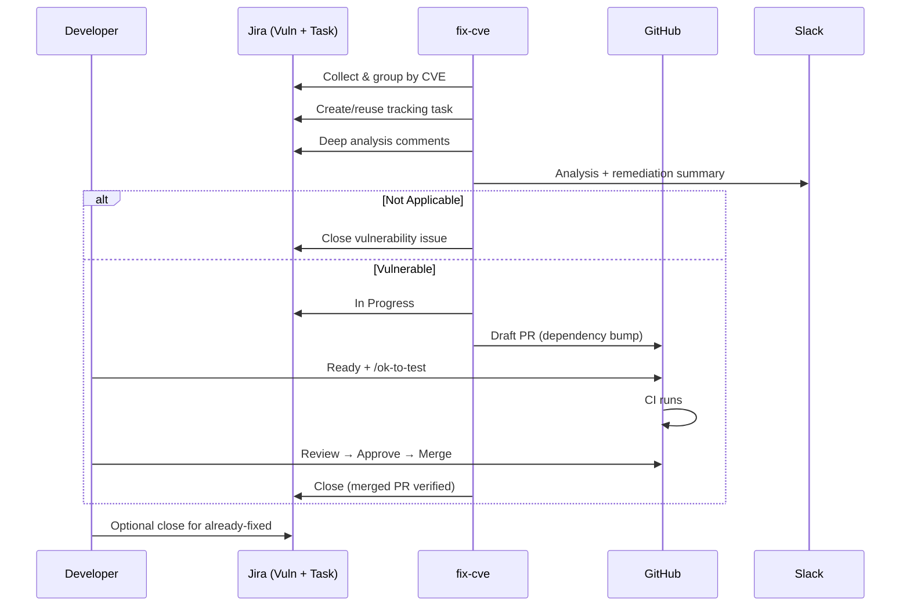

# Automated CVE Fix — Developer Guide

This guide describes the **end-to-end flow** for fixing Server Foundation ProsSec
vulnerability issues with
[server-foundation-agent](https://github.com/stolostron/server-foundation-agent).
It covers what runs automatically, what requires a human, and how a CVE moves from
scanner tickets to draft PRs, merged fixes, and closed Jira issues.

**Audience:** SF developers who review CVE impact analysis, groom bot PRs, approve
dependency bumps, and verify Jira closure.

**Operator docs** (agent-swarm prompt, phases, scripts): see
[prompts/fix-cve.md](../prompts/fix-cve.md) and
[.claude/skills/sfa-cve-analysis/SKILL.md](../.claude/skills/sfa-cve-analysis/SKILL.md).

---

## At a glance

| Stage | Who runs it | What happens | Human required? |
|-------|-------------|--------------|-----------------|
| 1. Collect & group | `fix-cve` (scheduled or on-demand) | Finds active SF Vulnerability issues; groups by CVE ID | No — review Slack |
| 2. Tracking task | `fix-cve` | Creates or reuses one Task per CVE (`CVE-YYYY-NNNNN (N issues, M repos)`) | No |
| 3. Deep analysis | `fix-cve` | Multi-branch impact analysis across SF repos | No — review comments |
| 4. Jira comments | `fix-cve` | Posts analysis on tracking task + each vulnerability issue | No |
| 5. Not Applicable | `fix-cve` | Closes issues with documented ➖ Not Applicable evidence | No — spot-check |
| 6. Draft PR | `fix-cve` | Opens draft PR per `(repo, branch, CVE)`; Jira → **In Progress** | No |
| 7. Slack digest | `fix-cve` | PR buckets + closures this run | No — act on Slack |
| 8. Groom PR | Developer | Mark ready, `/ok-to-test`, review | **Yes** |
| 9. Approve & merge | Developer | Approve and merge when CI is green | **Yes** |
| 10. Close on merge | `fix-cve` (next run) | Verifies merged PR via `gh`; closes vulnerability issues | No — verify |
| 11. Already fixed | Developer (optional) | Close ✅ Not Vulnerable issues after scan cleanup | **Optional** |

Unlike the [bug fix pipeline](automated-bug-fix-developer-guide.md), CVE remediation
does **not** require an opt-in label. ProsSec vulnerability issues in scope are
processed automatically. Agents **never** mark draft PRs ready, approve, merge, or
transition vulnerability issues to **Review** when a draft PR is opened.

---

## Issue types

| Jira type | Role | Example summary |
|-----------|------|-----------------|
| **Vulnerability** | ProsSec scanner ticket per image/component/branch | `[mce-2.8] ocm — CVE-2026-39821 HIGH golang.org/x/net` |
| **Task** | One tracking task per CVE (all repos/branches) | `CVE-2026-39821 (3 issues, 2 repos)` |

**Active vulnerability JQL** (what `fix-cve` monitors):

```text
project = ACM
AND issuetype = Vulnerability
AND component = "Server Foundation"
AND labels = Security
AND status NOT IN (Closed, Done)
```

Bulk container-scan tickets (e.g. `N HIGH CVEs` with no single CVE in the summary)
are excluded unless operators set `INCLUDE_BULK_SCANS`.

---

## End-to-end flow



### Swimlane view

Human–agent handoffs in sequence:



---

## Stage 1 — Collect and group (automatic)

**Agent:** [fix-cve](../prompts/fix-cve.md) Phases 1–2  
**Schedule:** On-demand or cron (example: weekdays 09:00 Asia/Shanghai)

### What it does

1. Queries active SF **Vulnerability** issues (Security label, not Closed/Done).
2. Extracts CVE IDs from summaries (`CVE-YYYY-NNNNN`) or `CVE-*` labels.
3. Groups issues by CVE into `cve_groups.json`.
4. Skips CVEs already fully analyzed (dedup — see below).

### Dedup between runs

A CVE is skipped when **all** are true:

1. An open tracking task exists (`summary ~ "CVE-{id}"`), **and**
2. Every active vulnerability issue for that CVE has a comment containing **both**
   `Deep CVE Impact Analysis` and `_— server-foundation-agent_`

If new scanner tickets appeared since the last run, only those missing the signature
get new comments. Override with `FORCE_REANALYSIS` in `instruction_prompt`.

### What you should do

- Watch the Slack digest or tracking task for newly processed CVEs.
- For a single CVE on demand: run `fix-cve` with `instruction_prompt: CVE-YYYY-NNNNN`.

---

## Stage 2 — Tracking task (automatic)

**Agent:** [fix-cve](../prompts/fix-cve.md) Phase 3

### What it does

For each CVE needing work:

1. Searches for an existing open tracking **Task** (`summary ~ "CVE-{id}"`).
2. If missing, generates the description with
   `format-cve-tracking-task.py` (never hand-format tables).
3. Creates the task:
   - Summary: `CVE-{id} ({issue_count} issues, {repo_count} repos)`
   - Work type: Security & Compliance (`10609`)
   - Assignee: Qing Hao preferred; falls back to `rjung@redhat.com`

### What you should do

- Use the tracking task as the **single pane** for a CVE across repos and branches.
- Link related work and PRs in comments on the tracking task if you take over manually.

---

## Stage 3 — Deep impact analysis (automatic)

**Agent:** [fix-cve](../prompts/fix-cve.md) Phase 4

### What it does

For each CVE in scope:

1. Fetches CVE metadata (affected package, fix version, description).
2. Clones SF repos and checks relevant release branches (see branch mapping below).
3. Per repo/branch: reads `go.mod`, runs `go mod why`, greps for direct usage.
4. Classifies impact:
   - ❌ Vulnerable
   - ⚠️ Potentially Vulnerable
   - ✅ Not Vulnerable (installed ≥ fix version)
   - ➖ Not Applicable (package not used / not reachable)

Older-branch upgrades follow
[older-branch-dep-upgrade](../solutions/older-branch-dep-upgrade.md) — minimal
`go get`, avoid OCM dependency tier jumps.

### Branch mapping (Jira → git)

| Jira bracket / version | Git branch |
|------------------------|------------|
| `[mce-2.8]` / MCE 2.8.x | `backplane-2.8` |
| `[mce-2.9]` | `backplane-2.9` |
| `[mce-2.10]` | `backplane-2.10` |
| `[mce-2.11]` | `backplane-2.11` |
| `[mce-2.17]` | `backplane-2.17` |
| `[acm-2.13]` / ACM 2.13.x | `release-2.13` |
| `[acm-2.14]` | `release-2.14` |
| (no bracket, mainline) | `main` |

Repos using `release-*` instead of `backplane-*`: `klusterlet-addon-controller`,
`cluster-permission`.

### What you should do

1. Read the **Deep CVE Impact Analysis** comment on the vulnerability issue or
   tracking task.
2. Verify classification if the CVE is high severity or the fix touches a sensitive
   code path — agent analysis is thorough but not infallible.
3. If analysis is wrong, add a correcting Jira comment; use `FORCE_REANALYSIS` on
   the operator side to re-run.

**Comment markers** (for dedup): heading `Deep CVE Impact Analysis` and footer
`_— server-foundation-agent_`.

---

## Stage 4 — Jira comments (automatic)

**Agent:** [fix-cve](../prompts/fix-cve.md)

### What it does

- Posts the **full** deep analysis report on the **tracking task**.
- Posts a **component-specific summary** on each vulnerability issue:
  - Repo, branch, installed vs fix version
  - Impact line, remediation command (`go get …`)
  - Link to tracking task

### What you should do

- Use per-issue comments when working a single scanner ticket.
- Use the tracking task comment when coordinating across branches.

---

## Stage 5 — Not Applicable closure (automatic)

**Agent:** [fix-cve](../prompts/fix-cve.md)

### What it does

When deep analysis classifies a vulnerability issue's repo/branch as **➖ Not
Applicable**:

1. Posts a comment with evidence (`go mod why`, grep results).
2. Transitions the issue to **Closed** (via In Progress when the workflow requires it).
3. Records the closure in the run's Slack digest under *Closed as Not Applicable*.

**Guardrail:** the agent closes **only** Not Applicable issues with documented
evidence. It never closes ❌ Vulnerable or ⚠️ Potentially Vulnerable issues without
a merged fix PR.

### What you should do

- Spot-check Not Applicable closures on first encounter with a new CVE pattern.
- If closure was wrong, reopen the issue and add context; the next run will not
  re-close unless analysis changes.

---

## Stage 6 — Draft PR (automatic)

**Agent:** [fix-cve](../prompts/fix-cve.md)

### When this runs

Classification is **❌ Vulnerable** or **⚠️ Potentially Vulnerable**, and no open
PR already exists for `(repo, branch, CVE)`.

### What it does

1. Transitions linked vulnerability issues to **In Progress** (if New/To Do).
2. Clones a worktree (`cve-{CVE-ID}-{branch-suffix}`).
3. Applies minimal fix (`go get`, `go mod tidy`, `go mod vendor` when vendored).
4. Runs `make check` and `make test`.
5. Opens a **draft** PR:
   - Title: `{CVE-ID}: bump {module} on {branch}`
   - Label: `sfa-assisted` (when the repo has the label)
   - Body lists all linked vulnerability issue keys
6. Comments on each linked issue with the PR URL.
7. Leaves status at **In Progress** — does **not** move to Review.

**Limit:** at most **one new PR per `(repo, branch, CVE)` per run**. Extra branches
appear in the run summary as human follow-ups.

### PR dedup

Before opening a PR, the agent verifies with `gh`:

```bash
gh pr list --repo <org/repo> --state open --search "<CVE-ID> in:title" \
  --json number,url,state,isDraft,mergedAt,title
```

If an open PR exists → links it, ensures issues are **In Progress**, skips creating
a duplicate.

### What you should do

- Watch Slack *Draft* bucket or Jira comments for new PR links.
- Do **not** expect CI until you mark the PR ready (Stage 8).

**Bot PR signals:**

| Signal | Value |
|--------|-------|
| Label | `sfa-assisted` |
| Branch | `cve-CVE-YYYY-NNNNN-{branch-suffix}` |
| Title | `CVE-YYYY-NNNNN: bump …` |

---

## Stage 7 — Slack digest (automatic)

**Agent:** [fix-cve](../prompts/fix-cve.md)

### What it does

When `SLACK_WEBHOOK_URL` is set, posts a Block Kit digest with:

| Section | Content |
|---------|---------|
| *Draft* | Open draft PRs needing **Ready for review** |
| *Ready for review* | Non-draft open PRs needing **Approve** |
| *Merged* | PRs merged (informational) |
| *Closed this run (merged PR)* | Vulnerability issues closed after merge verification |
| *Closed as Not Applicable* | Issues closed with N/A evidence this run |

PR state is refreshed via `gh` before posting (`enrich_remediation_prs.py`).

### What you should do

- Treat the Slack digest as your action queue for CVE PRs.
- CVE PRs may also appear in
  [agent-pr-action-needed](../prompts/agent-pr-action-needed.md) if they carry
  `sfa-assisted` — either digest is valid; act once.

---

## Stage 8 — Groom the PR (human gate)

After `fix-cve` creates a draft PR, **CI and formal review do not proceed** until
you complete these steps.

### Checklist

1. **Open the draft PR** (Slack link, Jira comment, or tracking task).
2. **Skim the diff** — dependency bumps should be minimal; watch for unintended
   transitive upgrades on older branches.
3. **Mark Ready for review** (GitHub: "Ready for review" on the draft).
4. If the PR has label **`needs-ok-to-test`**, comment:
   ```text
   /ok-to-test
   ```
5. Wait for CI; perform or delegate **code review**.

> **Note:** [jira-pipeline-pr-review](../prompts/jira-pipeline-pr-review.md) targets
> `ACM-*` bug-fix PRs from `jira-pipeline`. CVE PRs use `CVE-*` titles — address
> review feedback yourself or push fixes to the same branch.

---

## Stage 9 — Approve and merge (human gate)

| Action | Who |
|--------|-----|
| Approve PR | SF developer (org member) |
| Merge PR | Assignee or reviewer per team practice |

Agents never approve or merge. After merge, cherry-pick or backport per release
process if additional z-stream branches still have open vulnerability tickets.

---

## Stage 10 — Close on merged PR (automatic)

**Agent:** [fix-cve](../prompts/fix-cve.md) (runs each remediation phase)

### What it does

For **In Progress** vulnerability issues:

1. Discovers linked fix PR(s) (Jira development field, agent comments, or
   `gh pr list --state merged --search "{CVE-ID} in:title"`).
2. Verifies with `gh pr view` that `state` is **MERGED**.
3. Posts `CVE Remediation: PR merged` comment.
4. Transitions issue to **Closed**.

When one merged PR covers multiple vulnerability keys (listed in the PR body), **all**
still-In-Progress linked issues are closed.

### What you should do

1. After merge, wait for the next `fix-cve` run (or trigger on-demand with the CVE ID).
2. Verify vulnerability issues moved to **Closed** and Slack shows them under
   *Closed this run (merged PR)*.
3. If issues stay **In Progress** after merge:
   - Check for `CVE Remediation: PR merged` comment from `server-foundation-agent`.
   - Confirm `gh` shows the PR as merged and `baseRefName` matches the issue branch.
   - Re-run `fix-cve` with the CVE ID, or close manually after verification.

### Jira status automation summary

| Status | Set by | When |
|--------|--------|------|
| **In Progress** | `fix-cve` | Draft PR opened (or existing PR linked) |
| **Closed** (Not Applicable) | `fix-cve` | N/A classification with evidence |
| **Closed** (fix merged) | `fix-cve` | Fix PR **merged** (`gh` confirms `MERGED`) |
| **Review** | — | Not used in CVE flow (humans do not need this step) |

---

## Stage 11 — Already fixed (optional human step)

**Agent:** [fix-cve](../prompts/fix-cve.md)

When classification is **✅ Not Vulnerable** (installed version ≥ fix version):

- The agent documents evidence in the analysis comment.
- It records `skipped_already_fixed` but **does not close** the scanner ticket.

### What you should do

- Close or resolve already-fixed vulnerability issues when ProsSec/QE scan cleanup
  requires it — automation leaves this to humans intentionally.
- Reference the agent's version evidence in your close comment.

---

## Tracking task reference

| Field | Value |
|-------|-------|
| Type | Task |
| Summary pattern | `CVE-{id} ({N} issues, {M} repos)` |
| Work type | Security & Compliance |
| Purpose | Consolidated view of all repos/branches for one CVE |

Search existing trackers:

```text
project = ACM AND issuetype = Task AND component = "Server Foundation" AND summary ~ "CVE-{cve_id}"
```

---

## Schedule summary (example)

| Time | Agent | Purpose |
|------|-------|---------|
| Weekdays 09:00 | fix-cve | Full pipeline: analysis, comments, remediation, Slack |
| On-demand | fix-cve | `instruction_prompt: CVE-YYYY-NNNNN` |
| Weekdays 09:30 | agent-pr-action-needed | May list `sfa-assisted` CVE PRs (optional overlap) |

Throughput: at most **one new PR per `(repo, branch, CVE)` per run**. Multiple CVEs
can be processed in one run; deferred branches appear in follow-up notes.

---

## Human interaction summary

```text
YOU MUST ACT WHEN:
  ✓ Draft CVE PR exists              → Ready for review + /ok-to-test
  ✓ Review is clean                  → Approve
  ✓ CI green + approved              → Merge
  ✓ Wrong analysis                   → Correcting comment; operator re-run if needed
  ✓ Already-fixed scanner tickets    → Optional manual close

AGENTS ACT WITHOUT YOU:
  ✓ Group ProsSec tickets by CVE
  ✓ Create/reuse tracking tasks
  ✓ Deep multi-branch impact analysis
  ✓ Post Jira analysis comments
  ✓ Close Not Applicable issues (with evidence)
  ✓ Open draft dependency-bump PRs
  ✓ Move Jira to In Progress when fix PR exists
  ✓ Close vulnerability issues when fix PR is merged
  ✓ Slack digest with PR buckets and closures
```

---

## Common scenarios

### "New CVE scanner tickets appeared but nothing happened"

Check dedup: if the tracking task exists and all issues already have
`Deep CVE Impact Analysis` comments, the CVE is skipped until new tickets arrive.
Use `FORCE_REANALYSIS` on the operator side or run with the specific CVE ID.

### "Tracking task exists but no PR for my branch"

`fix-cve` opens at most one PR per `(repo, branch, CVE)` per run. Remaining branches
are listed in the run summary / Slack follow-up. Run again on-demand or open the
PR yourself using the remediation command from the analysis comment.

### "Issue was closed as Not Applicable but I disagree"

Reopen the issue, add evidence, and fix manually. The agent will not re-close unless
analysis is re-run and still classifies N/A.

### "PR is draft and CI is not running"

Mark **Ready for review** and post **`/ok-to-test`** if `needs-ok-to-test` is on the PR.

### "PR merged but vulnerability issue still In Progress"

Wait for the next `fix-cve` run or trigger on-demand with the CVE ID. Check
for `CVE Remediation: PR merged` comment. If comment exists but status unchanged, the
next run retries the transition.

### "Analysis says vulnerable but I know we're not affected"

Add a Jira comment with your evidence. Do not merge an unnecessary bump — close as N/A
manually or ask for re-analysis with `FORCE_REANALYSIS`.

### "Same CVE, multiple repos — one PR or many?"

One draft PR per `(repo, branch, CVE)`, linking all related vulnerability issue keys
for that repo/branch. Different repos or branches get separate PRs across runs.

### "I want to fix it myself"

Use the analysis comment's `go get` command and
[older-branch-dep-upgrade](../solutions/older-branch-dep-upgrade.md). Open a
human PR; the agent skips if an open PR with the CVE in the title already exists.

---

## instruction_prompt overrides (operator)

| Text | Effect |
|------|--------|
| `CVE-YYYY-NNNNN` | Analyze only that CVE (all statuses) |
| `FORCE_REANALYSIS` | Ignore dedup; repost all comments |
| `SKIP_DEEP_ANALYSIS` | Tracking tasks only (Phases 1–3) |
| `SKIP_REMEDIATION` | Analysis + Jira comments only (skip Phase 6) |
| `SKIP_SLACK` | Skip Slack Phase 7 |
| `INCLUDE_BULK_SCANS` | Include multi-CVE scanner tickets |

---

## Quick reference card

```text
NEW CVE SCANNER TICKETS
  → wait for fix-cve (schedule) or Slack digest
  → read tracking task + "Deep CVE Impact Analysis" on each issue

NOT APPLICABLE
  → agent closes automatically with evidence
  → spot-check first time for new CVE patterns

VULNERABLE
  → agent opens draft PR; Jira → In Progress
  → Ready for review + /ok-to-test
  → review → approve → merge
  → wait for fix-cve to close Jira (or trigger on-demand)

ALREADY FIXED (✅ Not Vulnerable)
  → agent documents evidence; does NOT auto-close
  → close manually when scan cleanup requires it

MULTIPLE BRANCHES
  → one PR per (repo, branch, CVE) per run
  → check Slack follow-up for remaining branches
```