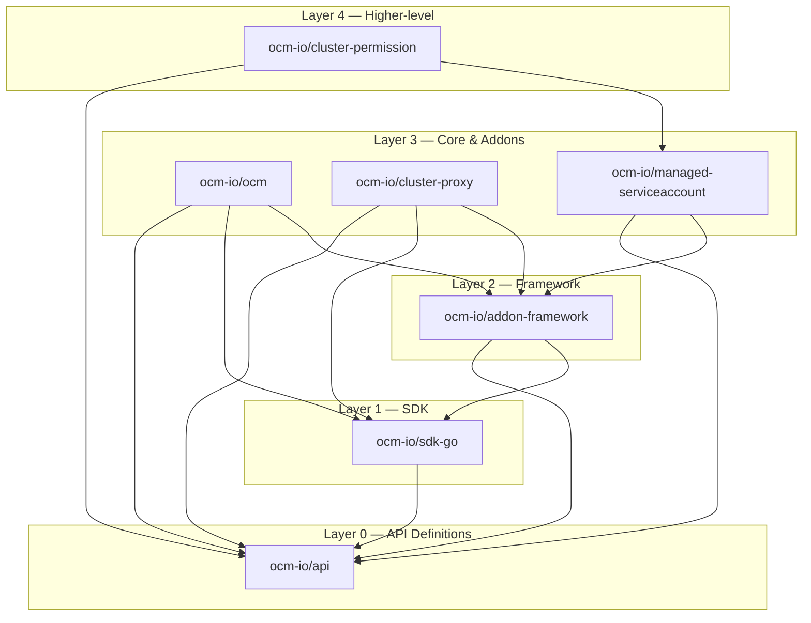
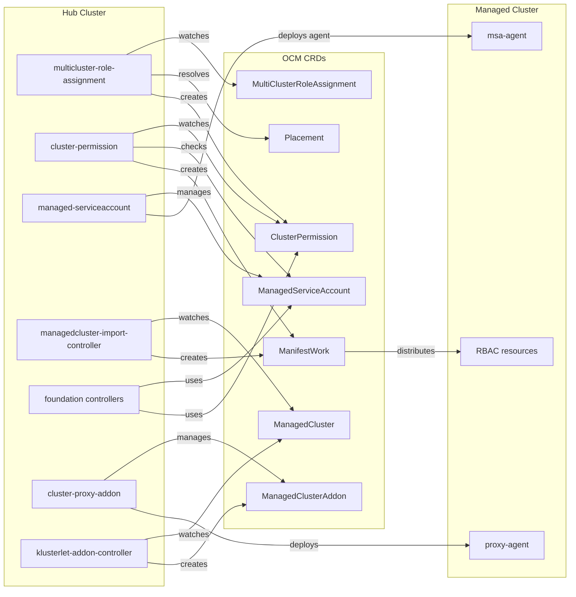

# Server Foundation Repository Dependencies

This document describes the inter-dependencies between all Server Foundation owned repositories.

For the repo list and branch conventions, see [repos.md](repos.md).

## Reference Materials

Load these on-demand based on the task:

| Reference | Path | When to Load |
|-----------|------|-------------|
| [Per-Repo Details](repo-deps/per-repo-details.md) | `docs/repo-deps/per-repo-details.md` | Looking up a specific repo's deps, consumers, or function |
| [Version Alignment](repo-deps/version-alignment.md) | `docs/repo-deps/version-alignment.md` | Checking dep version drift, planning upgrades |

## Dependency Overview Diagram

## Upstream (ocm-io) Dependency Layers

| Layer | Repo | Depends On | Provides |
|-------|------|------------|----------|
| 0 | `api` | (none) | All OCM CRD types: ManagedCluster, ManifestWork, Placement, AddOn, ClusterManager |
| 1 | `sdk-go` | api | Base controller factory, CloudEvents (MQTT/gRPC), cert rotation, patcher, CEL library |
| 2 | `addon-framework` | api, sdk-go | Addon manager, agent interface, addon factory, lease controller |
| 3 | `ocm` | api, sdk-go, addon-framework | OCM hub: registration, work, placement, addon-manager controllers |
| 3 | `cluster-proxy` | api, sdk-go, addon-framework | Konnectivity-based cluster proxy addon |
| 3 | `managed-serviceaccount` | api, addon-framework | Token-based ServiceAccount projection addon |
| 4 | `cluster-permission` | api, managed-serviceaccount | RBAC permission distribution across clusters |

## Downstream (stolostron) Dependencies

| Repo | Key SF Dependencies |
|------|---------------------|
| `managedcluster-import-controller` | api, sdk-go, ocm (chart helpers), cluster-lifecycle-api |
| `multicloud-operators-foundation` | api, sdk-go, addon-framework, managed-serviceaccount, cluster-permission, cluster-lifecycle-api |
| `clusterlifecycle-state-metrics` | api, cluster-lifecycle-api, stolostron/applier |
| `cluster-proxy-addon` | api, sdk-go, addon-framework |
| `klusterlet-addon-controller` | api, cluster-lifecycle-api |
| `multicluster-role-assignment` | api, cluster-permission |
| `backplane-operator` | api, sdk-go (deploys all SF components) |

## Deployment Dependency Graph

```mermaid
graph TD
    BPO["backplane-operator<br/><i>MCE Operator</i>"]

    subgraph "OCM Core (via ClusterManager CR)"
        REG["registration"]
        WORK["work"]
        PLACE["placement"]
        ADDONMGR["addon-manager"]
    end

    subgraph "Server Foundation Chart"
        MIC["managedcluster-import-controller"]
        OCMCTRL["ocm-controller<br/><i>(foundation)</i>"]
        OCMPROXY["ocm-proxyserver"]
    end

    subgraph "Toggle Components (optional)"
        CPERM["cluster-permission"]
        MSA["managed-serviceaccount"]
        CPA["cluster-proxy-addon"]
    end

    BPO -->|"ClusterManager CR"| REG
    BPO -->|"ClusterManager CR"| WORK
    BPO -->|"ClusterManager CR"| PLACE
    BPO -->|"ClusterManager CR"| ADDONMGR
    BPO -->|"server-foundation chart"| MIC
    BPO -->|"server-foundation chart"| OCMCTRL
    BPO -->|"server-foundation chart"| OCMPROXY
    BPO -->|"toggle chart"| CPERM
    BPO -->|"toggle chart"| MSA
    BPO -->|"toggle chart"| CPA

    classDef operator fill:#ffecb3,stroke:#ff8f00
    classDef core fill:#e1f5fe,stroke:#0288d1
    classDef sf fill:#e8f5e9,stroke:#388e3c
    classDef toggle fill:#fff3e0,stroke:#f57c00

    class BPO operator
    class REG,WORK,PLACE,ADDONMGR core
    class MIC,OCMCTRL,OCMPROXY sf
    class CPERM,MSA,CPA toggle
```

## Runtime Integration Flow

