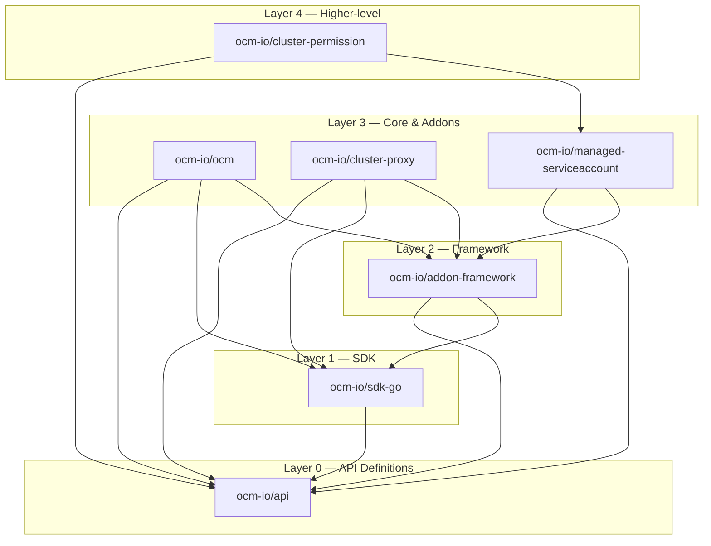
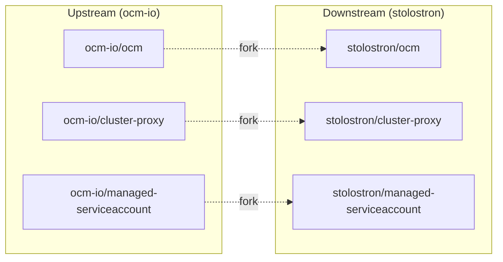
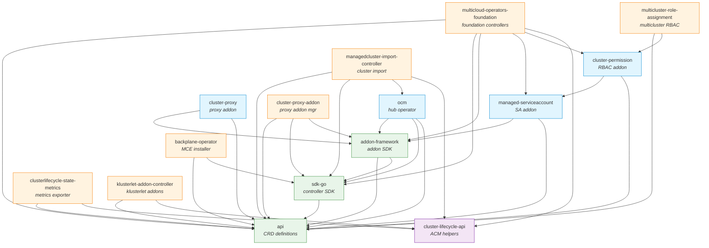
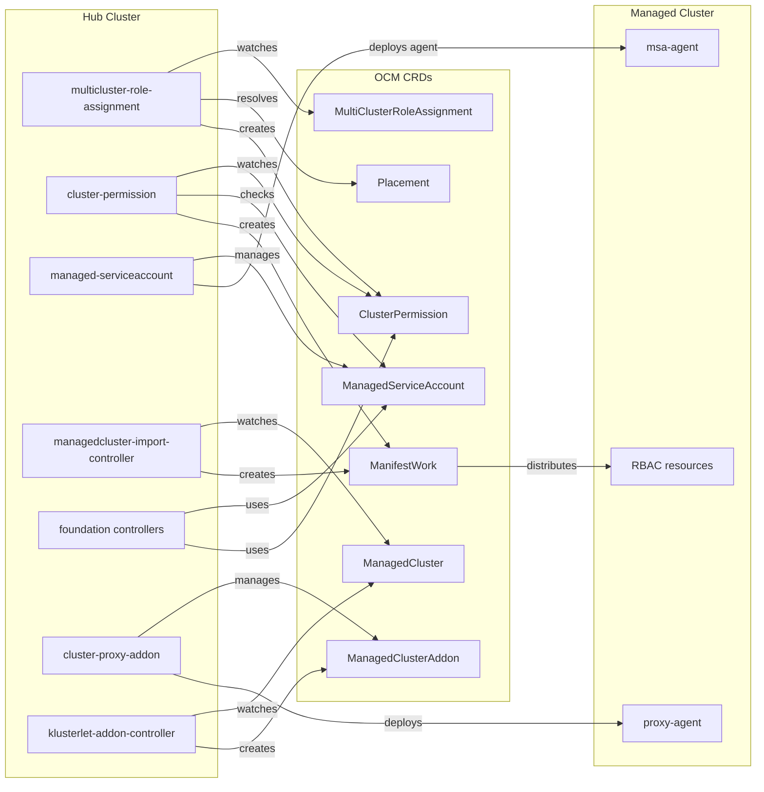

# Server Foundation Repository Dependencies

This document describes the inter-dependencies between all Server Foundation owned repositories, covering Go module imports, API/CRD type usage, runtime/functional coupling, test dependencies, and deployment relationships.

For the repo list and branch conventions, see [repos.md](repos.md).

## Dependency Overview Diagram

## Upstream (ocm-io) Dependency Layers

The upstream OCM repos follow a clean, acyclic layered architecture:

| Layer | Repo | Depends On | Provides |
|-------|------|------------|----------|
| 0 | `api` | (none) | All OCM CRD types: ManagedCluster, ManifestWork, Placement, AddOn, ClusterManager |
| 1 | `sdk-go` | api | Base controller factory, CloudEvents (MQTT/gRPC), cert rotation, patcher, CEL library |
| 2 | `addon-framework` | api, sdk-go | Addon manager, agent interface, addon factory, lease controller |
| 3 | `ocm` | api, sdk-go, addon-framework | OCM hub: registration, work, placement, addon-manager controllers |
| 3 | `cluster-proxy` | api, sdk-go, addon-framework | Konnectivity-based cluster proxy addon |
| 3 | `managed-serviceaccount` | api, addon-framework | Token-based ServiceAccount projection addon |
| 4 | `cluster-permission` | api, managed-serviceaccount | RBAC permission distribution across clusters |

No circular dependencies exist in the upstream layer.

## Downstream (stolostron) Dependencies

### Upstream Fork Relationships

Three stolostron repos are direct downstream forks of upstream ocm-io repos. They carry the same Go module path and share the same dependency structure.

### stolostron-only Repos

These repos exist only in stolostron (no upstream equivalent):

| Repo | Key SF Dependencies |
|------|---------------------|
| `managedcluster-import-controller` | api, sdk-go, stolostron/ocm (chart helpers), cluster-lifecycle-api |
| `multicloud-operators-foundation` | api, sdk-go, addon-framework, managed-serviceaccount, cluster-permission, cluster-lifecycle-api |
| `clusterlifecycle-state-metrics` | api, cluster-lifecycle-api, stolostron/applier |
| `cluster-proxy-addon` | api, sdk-go, addon-framework |
| `klusterlet-addon-controller` | api, cluster-lifecycle-api |
| `multicluster-role-assignment` | api, cluster-permission |
| `backplane-operator` | api, sdk-go (deploys all SF components) |

## Full Dependency Graph

## Deployment Dependency Graph

```mermaid
graph TD
    BPO["backplane-operator<br/><i>MCE Operator</i>"]

    subgraph "OCM Core (via ClusterManager CR)"
        REG["registration"]
        WORK["work"]
        PLACE["placement"]
        ADDONMGR["addon-manager"]
    end

    subgraph "Server Foundation Chart"
        MIC["managedcluster-import-controller"]
        OCMCTRL["ocm-controller<br/><i>(foundation)</i>"]
        OCMPROXY["ocm-proxyserver"]
    end

    subgraph "Toggle Components (optional)"
        CPERM["cluster-permission"]
        MSA["managed-serviceaccount"]
        CPA["cluster-proxy-addon"]
    end

    BPO -->|"ClusterManager CR"| REG
    BPO -->|"ClusterManager CR"| WORK
    BPO -->|"ClusterManager CR"| PLACE
    BPO -->|"ClusterManager CR"| ADDONMGR
    BPO -->|"server-foundation chart"| MIC
    BPO -->|"server-foundation chart"| OCMCTRL
    BPO -->|"server-foundation chart"| OCMPROXY
    BPO -->|"toggle chart"| CPERM
    BPO -->|"toggle chart"| MSA
    BPO -->|"toggle chart"| CPA

    classDef operator fill:#ffecb3,stroke:#ff8f00
    classDef core fill:#e1f5fe,stroke:#0288d1
    classDef sf fill:#e8f5e9,stroke:#388e3c
    classDef toggle fill:#fff3e0,stroke:#f57c00

    class BPO operator
    class REG,WORK,PLACE,ADDONMGR core
    class MIC,OCMCTRL,OCMPROXY sf
    class CPERM,MSA,CPA toggle
```

This diagram shows how `backplane-operator` deploys all SF components at runtime:

## Runtime Integration Flow

This diagram shows how components interact at runtime:

## Detailed Per-Repo Dependencies

### open-cluster-management-io (upstream)

#### api
- **Go deps on SF repos**: None (foundation layer)
- **Provides**: All OCM CRD types — ManagedCluster, ManifestWork, Placement, ManagedClusterAddOn, ClusterManagementAddOn, ClusterManager, Klusterlet
- **Used by**: Every other SF repo

#### sdk-go
- **Go deps**: api
- **Provides**: Base controller factory, CloudEvents (MQTT/gRPC/PubSub), cert rotation, patcher, CEL library, serving cert
- **Used by**: addon-framework, ocm, cluster-proxy, managedcluster-import-controller, multicloud-operators-foundation, cluster-proxy-addon, backplane-operator

#### addon-framework
- **Go deps**: api, sdk-go
- **Provides**: Addon manager, agent interface, addon factory, lease controller, test utilities
- **Used by**: ocm, cluster-proxy, managed-serviceaccount, multicloud-operators-foundation, cluster-proxy-addon

#### ocm
- **Go deps**: api, sdk-go, addon-framework
- **Provides**: OCM hub implementation — registration, work, placement, addon-manager controllers; Helm chart helpers
- **Used by**: managedcluster-import-controller (chart helpers)

#### cluster-proxy
- **Go deps**: api, sdk-go, addon-framework
- **External deps**: apiserver-network-proxy (konnectivity)
- **Provides**: Konnectivity-based proxy for accessing managed clusters

#### managed-serviceaccount
- **Go deps**: api, addon-framework (sdk-go indirect)
- **Provides**: ManagedServiceAccount CRD and addon for token-based SA projection
- **Used by**: cluster-permission, multicloud-operators-foundation

#### cluster-permission
- **Go deps**: api, managed-serviceaccount
- **Provides**: ClusterPermission CRD for RBAC distribution via ManifestWork
- **Used by**: multicluster-role-assignment, multicloud-operators-foundation

### stolostron (downstream)

#### managedcluster-import-controller
- **Go deps**: api, sdk-go, ocm (chart helpers), cluster-lifecycle-api
- **Function**: Manages cluster import workflow, creates ManifestWork for cluster bootstrap

#### multicloud-operators-foundation
- **Go deps**: api, sdk-go, addon-framework, managed-serviceaccount, cluster-permission, cluster-lifecycle-api
- **Function**: Foundation controllers — heaviest dependency footprint among SF repos
- **Note**: Uses both managed-serviceaccount and cluster-permission client APIs

#### clusterlifecycle-state-metrics
- **Go deps**: api (v1.1.0), cluster-lifecycle-api, stolostron/applier, stolostron/library-go
- **Function**: Prometheus metrics exporter for cluster lifecycle
- **Note**: Uses outdated api v1.1.0

#### cluster-proxy-addon
- **Go deps**: api (v0.15.0), sdk-go (v0.15.0), addon-framework (v0.11.0)
- **Function**: Addon manager for cluster-proxy deployment
- **Note**: Uses very outdated dependencies — deprecated from backplane-2.11

#### klusterlet-addon-controller
- **Go deps**: api (v0.14.1), cluster-lifecycle-api
- **Function**: Creates ManagedClusterAddon resources for klusterlet add-ons

#### multicluster-role-assignment
- **Go deps**: api, cluster-permission
- **Function**: Higher-level abstraction — uses Placement to create ClusterPermission per cluster

#### backplane-operator
- **Go deps**: api (v0.13.0), sdk-go
- **Function**: MCE operator — deploys all SF components via Helm charts
- **Manages**: ClusterManager CR, server-foundation, cluster-permission, managed-serviceaccount, cluster-proxy-addon

## Version Alignment

| Repo | api version | sdk-go version | addon-framework version | Status |
|------|-------------|----------------|------------------------|--------|
| sdk-go | v1.2.1 | — | — | Current |
| addon-framework | v1.2.1 | v1.2.1 | — | Current |
| ocm | v1.2.1 | v1.2.1 | v1.2.1 | Current |
| cluster-proxy | v1.2.0 | v1.2.0 | v1.2.0 | Current |
| managed-serviceaccount | v1.2.0 | — | v1.2.0 | Current |
| multicloud-operators-foundation | v1.2.1 | v1.2.1 | v1.2.1 | Current |
| managedcluster-import-controller | v1.2.0 | v1.2.1 | — | Current |
| multicluster-role-assignment | v1.2.0 | — | — | Current |
| cluster-permission | **v0.15.0** | — | — | Outdated |
| clusterlifecycle-state-metrics | **v1.1.0** | — | — | Outdated |
| cluster-proxy-addon | **v0.15.0** | **v0.15.0** | **v0.11.0** | Very outdated |
| klusterlet-addon-controller | **v0.14.1** | — | — | Outdated |
| backplane-operator | **v0.13.0** | **v0.13.1** | — | Outdated |

## Key Observations

1. **Clean layered architecture** — No circular dependencies in the upstream layer. Each layer only depends on layers below it.

2. **`api` is the universal foundation** — Every SF repo depends on it. Changes here have the widest blast radius.

3. **`multicloud-operators-foundation` is the heaviest consumer** — It depends on api, sdk-go, addon-framework, managed-serviceaccount, cluster-permission, and cluster-lifecycle-api.

4. **`backplane-operator` is the deployment root** — It deploys all MCE/SF components via Helm charts and ClusterManager CR.

5. **Version drift** — Several downstream repos use significantly outdated dependency versions. `cluster-proxy-addon` (deprecated from backplane-2.11) is the most outdated.

6. **`cluster-lifecycle-api` is a shared stolostron dependency** — Used by managedcluster-import-controller, multicloud-operators-foundation, clusterlifecycle-state-metrics, and klusterlet-addon-controller.

7. **Runtime chain**: `multicluster-role-assignment → cluster-permission → ManifestWork → managed cluster RBAC` forms the RBAC distribution pipeline.
