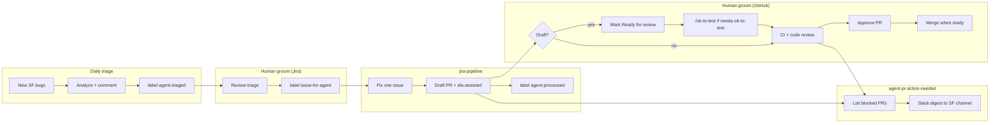

# Agent PR Action Reminder Workflow

After **`jira-pipeline`** (or on-demand **`jira-solve`**) opens a **draft** PR via
the `acm-agent` GitHub App, the PR stays blocked until Server Foundation
developers take manual GitHub actions. This workflow **lists** those PRs and
**notifies Slack** — it does not perform the actions.

Agent-swarm runnable prompt: [prompts/agent-pr-action-needed.md](../prompts/agent-pr-action-needed.md)

## Trigger phrases

- `agent PR action`, `agent PR reminder`, `notify agent PRs`
- `draft agent PRs`, `acm-agent PRs need review`

## End-to-end automation model



See also the Jira-focused diagram in [prompts/README.md](../prompts/README.md#jira-automation-model).

## What blocks agent PRs

| State | Typical labels | Why it is stuck | Human action |
|-------|----------------|-----------------|--------------|
| Draft | `sfa-assisted`, often `needs-ok-to-test` | Pipeline creates draft only; Prow blocks external/bot CI | Mark **Ready for review**; comment **`/ok-to-test`** |
| Open, not approved | `sfa-assisted`, CI may be green | Branch protection requires org-member approval | **Approve** on GitHub |
| Changes requested | — | Reviewer asked for edits | Fix or delegate back to agent — **not** in this digest |

### `needs-ok-to-test`

On stolostron/openshift org repos, non-member and bot PRs receive
`needs-ok-to-test` until a trusted org member comments `/ok-to-test`. Agent PRs
from `acm-agent[bot]` are in this category. Marking ready alone does not start
Prow until `/ok-to-test` is posted.

## Workflow phases

```
Phase 1: Collect     →  Phase 2: Classify        →  Phase 3: Slack payload  →  Phase 4: Send
fetch-prs.sh (all)         filter_agent_prs.jq          generate_slack_payload.py    send_to_slack.sh
```

### Bundled scripts

```
workflows/agent-pr-action-needed/
├── filter_agent_prs.jq           # Phase 2: bucket draft vs awaiting approval
└── generate_slack_payload.py     # Phase 3: Block Kit JSON
```

**Dependencies:**

- `.claude/skills/sfa-github-fetch-prs/fetch-prs.sh`
- `.claude/skills/sfa-slack-notify/send_to_slack.sh`
- `workflows/lib/slack_blocks.py`

### Phase 1: Collect

Uses `fetch-prs.sh all` — open PRs across SF stolostron downstream repos from
`repos/repos.yaml`. Cached 5 minutes by default; pass `nocache` for a fresh pull.

### Phase 2: Classify

`filter_agent_prs.jq` keeps PRs that match **agent PR signals**:

- Author `acm-agent` / `app/acm-agent`
- Label `sfa-assisted`
- Branch `fix-ACM-*` or `sfa/fix-ACM-*`

Then splits into:

1. **`draft_ready_for_review`** — `isDraft == true`
2. **`awaiting_approval`** — not draft and `reviewDecision == REVIEW_REQUIRED`

### Phase 3–4: Slack

`generate_slack_payload.py` builds a Block Kit message with:

- `@acm-server-foundation` group mention
- Section per bucket with linked PR lines (repo, Jira key from title, age, action hint)
- Footer timestamp

Send via `send_to_slack.sh` using `SLACK_WEBHOOK_URL`.

## Scheduling (agent-swarm example)

Run **after** `jira-pipeline` so new draft PRs appear in the same day's digest:

| Session | Cron (Asia/Shanghai) | Prompt |
|---------|----------------------|--------|
| `sfa-jira-pipeline` | `0 9,17 * * 1-5` | `jira-pipeline.md` |
| `sfa-agent-pr-action-needed` | `30 9,17 * * 1-5` | `agent-pr-action-needed.md` |

Optional weekday mid-day nudge: `0 14 * * 1-5`.

## Configuration

| Variable | Purpose |
|----------|---------|
| `SLACK_WEBHOOK_URL` | Incoming webhook for the SF team channel |
| `GH_TOKEN` / `gh auth` | List PRs and read review state |

Configure the webhook in the Swarmer workspace secret or
`swarmer-agent-extra-env` (same pattern as daily bug triage).

## Edge cases

- **Empty buckets:** Still post Slack when webhook is set — confirms the job ran
- **Missing `sfa-assisted` label:** PRs still match via author or branch name
- **`CHANGES_REQUESTED`:** Excluded from `awaiting_approval`; humans fix or re-run agent
- **Repo fetch failure:** `fetch-prs.sh` skips failed repos with a warning; note in summary
- **Fork PRs:** Unlikely for autonomous `acm-agent` mode; included if they match signals

## Related workflows

| Workflow | Relationship |
|----------|--------------|
| [jira-pipeline](../prompts/jira-pipeline.md) | Creates the draft PRs this workflow tracks |
| [jira-solve](../prompts/jira-solve.md) | On-demand single-issue path; same PR conventions |
| [weekly-bot-pr-hygiene](weekly-bot-pr-hygiene.md) | Konflux bot PRs — different author filter |
| [weekly-pr-report](weekly-pr-report.md) | Team-wide PR activity, not agent action items |
