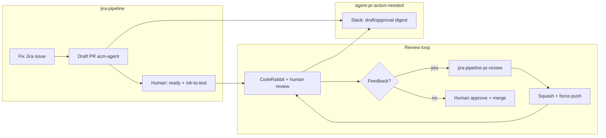

# Jira-Pipeline PR Review Feedback Workflow

After **`jira-pipeline`** (or on-demand **`jira-solve`**) opens a fix PR and humans
mark it ready, CodeRabbit and human reviewers leave review comments. This workflow
**addresses code-fix review feedback**, squashes commits, and **force-pushes** the branch.

Only feedback that requires **edits to code or tests in the PR diff** is in scope.
Process, CI-grooming, and other non-code comments are skipped.

Agent-swarm runnable prompt: [prompts/jira-pipeline-pr-review.md](../prompts/jira-pipeline-pr-review.md)

Jira: [ACM-35748](https://redhat.atlassian.net/browse/ACM-35748)

## Trigger phrases

- `jira-pipeline PR review`, `address agent PR feedback`
- `fix review comments on acm-agent PR`
- `pipeline PR review feedback`

## Position in automation model



| Workflow | Relationship |
|----------|--------------|
| [jira-pipeline](../prompts/jira-pipeline.md) | Creates the PRs this workflow updates |
| [jira-solve](../prompts/jira-solve.md) | Same PR conventions; included via author + `sfa-assisted` + title |
| [agent-pr-action-needed](agent-pr-action-needed.md) | Notifies humans about draft/approval gates; does not fix feedback |

## PR scope

Only PRs matching **jira-pipeline conventions**:

| Signal | Value |
|--------|-------|
| Author | `acm-agent` / `app/acm-agent` |
| Label | `sfa-assisted` |
| Title | Contains `ACM-<digits>` |
| Draft | `false` |

Branch shape is not a gate. Retries (`-v2`) and legacy `fix/ACM-*` paths are
included when the signals above match.

This excludes human PRs, Konflux bot PRs, and draft PRs still awaiting human groom.

## Workflow phases

```text
Phase 1: Collect      →  Phase 2: Filter + pick  →  Phase 3: Clone
fetch-prs.sh (all)         filter_pipeline_prs.jq      clone-worktree.sh (PR mode)
                           collect_review_feedback.py
Phase 4: Fix          →  Phase 5: Squash + push  →  Phase 6: Jira comment
address comments           reset --soft + commit -s     MCP add_comment
make check/test            push --force-with-lease
```

### Bundled scripts

```text
workflows/jira-pipeline-pr-review/
├── filter_pipeline_prs.jq       # Phase 2: acm-agent + sfa-assisted + ACM title filter
└── collect_review_feedback.py   # Phase 2: GitHub review thread enrichment + pick
```

**Dependencies:**

- `.claude/skills/sfa-github-fetch-prs/fetch-prs.sh`
- `.claude/skills/sfa-workspace-clone/clone-worktree.sh`

### Phase 1: Collect

Same pattern as [agent-pr-action-needed](agent-pr-action-needed.md#phase-1-collect):

```bash
bash .claude/skills/sfa-github-fetch-prs/fetch-prs.sh all \
  2> .output/jira-pipeline-pr-review/fetch.log \
  > .output/jira-pipeline-pr-review/raw_prs.json
```

### Phase 2: Filter and pick

```bash
jq -f workflows/jira-pipeline-pr-review/filter_pipeline_prs.jq \
  .output/jira-pipeline-pr-review/raw_prs.json \
  > .output/jira-pipeline-pr-review/pipeline_prs.json

python3 workflows/jira-pipeline-pr-review/collect_review_feedback.py \
  .output/jira-pipeline-pr-review/pipeline_prs.json \
  .output/jira-pipeline-pr-review/review_candidates.json
```

`collect_review_feedback.py` marks a PR as needing action when:

- Unresolved review threads with **code-fix** comments from CodeRabbit / humans, or
- `reviewDecision == CHANGES_REQUESTED` **and** the review body or inline threads
  contain actionable code-change requests

Non-code feedback alone (e.g. `/ok-to-test`, "mark ready", CI rerun, questions)
does **not** qualify.

Picks the candidate with the **oldest** code-fix feedback timestamp (FIFO queue).

### Code-fix scope (Phase 4)

Before editing, classify each comment:

| Act on | Skip |
|--------|------|
| Inline diff fixes, test additions, CodeRabbit suggested patches | Process/grooming, CI-only, questions, LGTM, out-of-scope work |
| Security/quality tied to changed lines | Jira/release notes, informational walkthroughs |

If no code-fix items remain after classification: stop without push.

### Phase 3–5: Fix, squash, force-push

See [prompts/jira-pipeline-pr-review.md](../prompts/jira-pipeline-pr-review.md) for
agent instructions. Key requirements:

1. Classify feedback; address **code-fix** items only
2. `make check` + `make test` before push (when code changed)
3. Squash to one commit via `git reset --soft $(git merge-base HEAD origin/<base>)`
4. `git push --force-with-lease` (required — agent branches accumulate commits)

### Phase 6: Jira comment

When the PR title contains `ACM-<digits>`, post a brief MCP comment on that issue.

## Scheduling (agent-swarm example)

Run **after** `jira-pipeline` and human groom windows so PRs are non-draft with
review feedback:

| Session | Cron (Asia/Shanghai) | Prompt |
|---------|----------------------|--------|
| `sfa-jira-pipeline` | `0 9,17 * * 1-5` | `jira-pipeline.md` |
| `sfa-jira-pipeline-pr-review` | `0 10,18 * * 1-5` | `jira-pipeline-pr-review.md` |
| `sfa-agent-pr-action-needed` | `30 9,17 * * 1-5` | `agent-pr-action-needed.md` |

Optional mid-day pass: `0 14 * * 1-5`.

## Configuration

| Variable | Purpose |
|----------|---------|
| `GH_TOKEN` / `gh auth` | List PRs, read reviews, push as acm-agent |
| `GH_APP_ID` + `GH_APP_INSTALLATION_ID` | Autonomous push to upstream (agent-swarm) |
| Jira MCP | Comment on linked ACM issue |

## Edge cases

- **No candidates:** Stop successfully — no pipeline PRs need code-fix feedback
- **Only non-code feedback:** Classify and skip; do not force-push
- **Approved PR with open nit threads:** Only act on threads requesting code changes;
  skip acknowledgments and process notes
- **CHANGES_REQUESTED from human:** Always address before push
- **Concurrent human pushes:** `--force-with-lease` fails safely — report and stop
- **Missing make targets:** Run available verification; note in summary
- **Fork PRs:** Unlikely for `acm-agent` autonomous mode; excluded by author filter

## Related

- [prompts/README.md](../prompts/README.md#jira-automation-model) — full automation model
- [ACM-35671](https://redhat.atlassian.net/browse/ACM-35671) — parent jira-pipeline work
- [ACM-35748](https://redhat.atlassian.net/browse/ACM-35748) — this workflow
